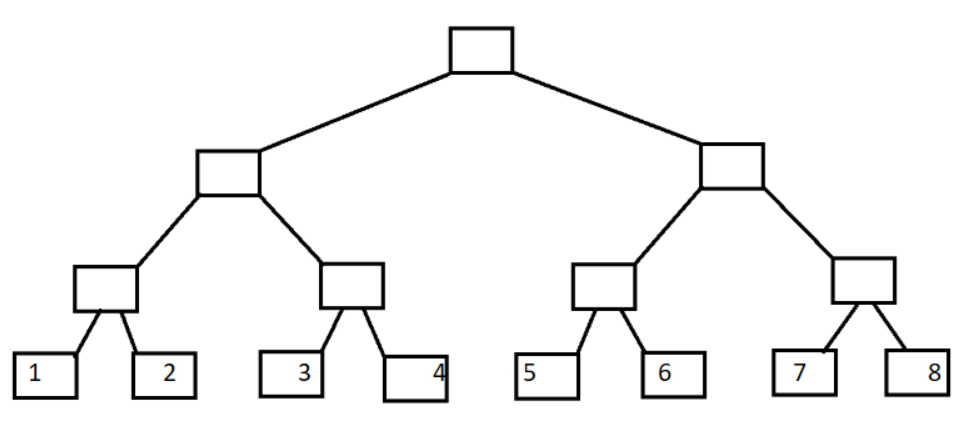
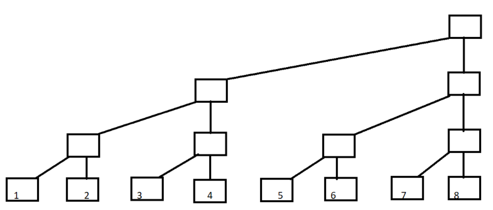
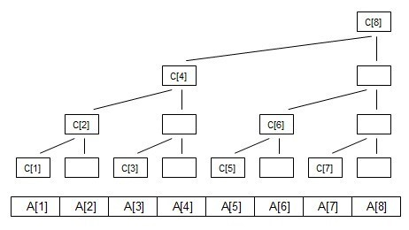
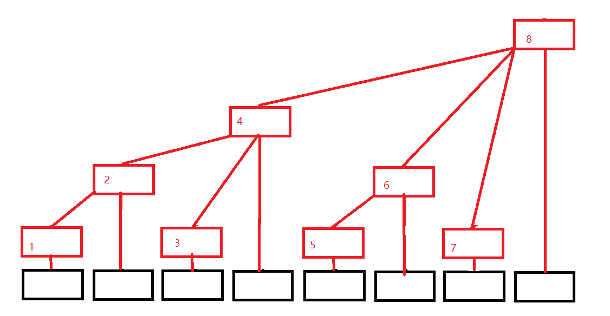

## 树状数组

### 概念
1. 什么是树状数组？

​        顾名思义，就是用数组来模拟树形结构呗。那么衍生出一个问题，为什么不直接建树？答案是没必要，因为树状数组能处理的问题就没必要建树。和 $Trie$ 树的构造方式有类似之处。

2. 树状数组可以解决什么问题

​        可以解决大部分基于区间上的更新以及求和问题。

3. 树状数组和线段树的区别在哪里

​        树状数组可以解决的问题都可以用线段树解决，这两者的区别在哪里呢？树状数组的系数要少很多，就比如字符串模拟大数可以解决大数问题，也可以解决1+1的问题，但没人会在1+1的问题上用大数模拟。

4. 树状数组的优点和缺点

​        修改和查询的复杂度都是 $O(logN)$ ，而且相比线段树系数要少很多，比传统数组要快，而且容易写。
​        缺点是遇到复杂的区间问题还是不能解决，功能还是有限。

### 介绍
​       树状数组  重点是在树状的数组 使用普通的二叉树表示数组如下 叶子结点代表 $A$ 数组 $A[1]-A[8]$



​       现在变形一下



​        如果每个父亲都存的是两个儿子的值，是不是就可以解决这类区间问题了呢。是的没错，但是这样的树形结构，叫做线段树。
现在定义每一列的顶端结点 $C[]$ 数组，如下图



​       那真的的树形结构是怎样的，和上图类似，但省去了一些节点，以达到用数组建树。



​        黑色数组代表原来的数组（下面用 $A[i]$ 代替），红色结构代表我们的树状数组(下面用 $C[i]$ 代替)，发现没有，每个位置只有一个方框，令每个位置存的就是子节点的值的和，则有

> $C[1] = A[1];$
> $C[2] = A[1] + A[2];$
> $C[3] = A[3];$
> $C[4] = A[1] + A[2] + A[3] + A[4];$
> $C[5] = A[5];$
> $C[6] = A[5] + A[6];$
> $C[7] = A[7];$
> $C[8] = A[1] + A[2] + A[3] + A[4] + A[5] + A[6] + A[7] + A[8];$

​        可以发现，这颗树是有规律的 $C[i] = A[i - 2k+1] + A[i - 2k+2] + ... + A[i]; $  // $k$ 为 $i$ 的二进制中从最低位到高位连续零的长度，**例如i=8时，k=3;** 例如i = 8(1000)时候，k = 3，可自行验证。

​       这个怎么实现求和呢，比如我们要找前7项和，那么应该是 $SUM = C[7] + C[6] + C[4]$; 而根据上面的式子，容易的出 $SUMi = C[i] + C[i-2k1] + C[(i - 2k1) - 2k2] + .....$ ； 其实树状数组就是一个二进制上面的应用。 现在新的问题来了 $2^k$ 该怎么求呢，不难得出 **2^k = i\&(i^(i-1)) **;但这个还是不好求，前辈的智慧就出来了，$2^k = i\&(-i)$，而且这个有一个专门的称呼，叫做$lowbit$，即取 $2^k$ 。

#### lowbit
​       $lowbit(x)$ 其实就是取出x的最低位$1$ ，换言之  $lowbit(x)=2^k$  ，$k$ 的含义与上面相同。

代码：
```java
public int lowbit(int x) {
    return x & (-x);
}
```

### 建立
​       首先，定义原数组为 $A[\ ]$，树状（前缀和）数组为 $B[\ ]$ ，一般第 $0$ 号元素不用.

#### 单点更新

​       当我们修改A[]数组中的某一个值时  应当如何更新 $C[\ ]$ 数组呢？ 回想一下 区间查询的过程，再看一下上文中列出的图，可以发现**更新过程是查询过程的逆过程，由叶子结点向上更新 $C[ ]$ 数组**。

代码
```java
void add(int x, int d) {
    for (int i = x; i <= n; i += lowbit(i)) {
        C[i] += d;
    }
}
```

> 如图：
> 
> 
>
> 当更新 $A[1]$ 时  需要向上更新 $C[1] , C[2], C[4], C[8]$
>                          C[1],        C[2],        C[4],         C[8]
> 写为二进制  C[(001)],  C[(010)],  C[(100)],  C[(1000)]
>                                                      1(001)        C[1]+=A[1]
> lowbit(1) = 001 1 + lowbit(1) = 2(010)        C[2]+=A[1]
> lowbit(2) = 010 2 + lowbit(2) = 4(100)        C[4]+=A[1]
> lowbit(4) = 100 4 + lowbit(4) = 8(1000)      C[8]+=A[1]

#### 单点查询
​        利用C[i]数组，求A数组中前i项的和 
举个例子 

> i=7;
> sum[7] = A[1] + A[2] + A[3] + A[4] + A[5] + A[6] + A[7] ;   
> 前 i 项和  C[4] = A[1] + A[2] + A[3] + A[4];   
>                     C[6] = A[5] + A[6];   
>                     C[7] = A[7] ;
> 可以推出:  sum[7]=C[4]+C[6]+C[7];
> 序号写为二进制: sum[(111)]=C[(100)]+C[(110)]+C[(111)];

代码：
```java
int getSum(int x) {
    int ans = 0;
    for (int i = x; i > 0; i -= lowbit(i)) {
        ans += C[i];
    }
    return ans;
}
```

> 对于i=7 进行演示
>                                                       7(111)    ans+=C[7]
> lowbit(7)=001  7 - lowbit(7) = 6(110)    ans+=C[6]
> lowbit(6)=010  6 - lowbit(6) = 4(100)    ans+=C[4]
> lowbit(4)=100  4 - lowbit(4) = 0(000)    


#### 调用

```java
int[] A = new int[N], C = new int[N + 1]; // C数组第0号元素不用
for (int i = 0; i< N; i++) {
    add(i + 1, A[i]);
}
```

### 模板一★
代码
```java
package algorithms;

import java.util.Arrays;

/**
 * 树状数组，适用于【单点修改，区间查询】和【区间修改，单点查询】
 */
public class BinaryIndexedTree {
    /**
     * A: -> 原始数组  <br>
     * C: -> 前缀和数组
     */
    int[] A, C;
    int n;
    boolean error = false;

    public static void main(String[] args) {
        int[] array = new int[17];
        BinaryIndexedTree bit = new BinaryIndexedTree(array);
        for (int i = 0; i < array.length; i++) {
            array[i] = i + 1;
            bit.add(i + 1, array[i]);
        }
        System.out.println(Arrays.toString(bit.A));
        System.out.println(Arrays.toString(bit.C));
        System.out.println(bit.getSum(15));
        System.out.println(bit.getSumOfRange(15, 16));
        bit.addOfRange(2, 3, 4);
        System.out.println(bit.getSumOfRange(2, 3));
    }

    public BinaryIndexedTree(int[] A) {
        this.A = A;
        this.n = this.A.length;
        this.C = new int[n + 1];
    }

    /**
     * <p>
     * 对 x 进行 x & (~x + 1) 操作，即返回 x 二进制中第一个 1 及后面的 0，(x&x补码）
     * </p>
     * <p>
     * Example: x = 6(110), lowbit(x) = 2(10)
     * </p>
     * <p>
     *     <ul>
     *         <li>计算整数x的二进制表示有多少个1： x&=x-1可以消除x最低位的1，while循环计数，直到x=0即可。</li>
     *         <li>只保留整数x最低位的1： x&-x ，暨鼎鼎大名的 lowbit</li>
     *     </ul>
     * </p>
     *
     * @param x 操作数 x
     * @return return x & (~x + 1)
     */
    public int lowbit(int x) {
        return x & (-x);
    }

    /**
     * 在 p 位置上加 x，单点更新
     * <p>
     * 节点 c[x] 的父节点为 c[x + lowbit(x)}], see {@link #lowbit(int)}
     * </p>
     * <p>
     * Example: 更新 A[1]：
     *     <ol>
     *         <li> 1(001) C[1] += A[1] </li>
     *         <li> lowbit(1) = 001, 1 + lowbit(1) = 2(010), C[2] += A[1] </li>
     *         <li> lowbit(2) = 010, 2 + lowbit(2) = 4(100), C[4] += A[1] </li>
     *         <li> lowbit(4) = 100, 4 + lowbit(4) = 8(1000), C[8] += A[1] </li>
     *     </ol>
     * </p>
     *
     * @param p 更新位置
     * @param x 要更新的数
     */
    public void add(int p, int x) { //
        // x为更新的位置，y为更新后的数，n为数组最大值
        for (int i = p; i <= n; i += lowbit(i)) {
            C[i] += x;
        }
    }

    /**
     * 区间修改，给区间 [left, right] 加上x
     *
     * @param left  左边起始索引 - 包括
     * @param right 右边结束索引 - 包括
     * @param x     要添加的数
     */
    public void addOfRange(int left, int right, int x) {
        error = true;
        add(left, x);
        add(right + 1, -x);
    }

    /**
     * 求 A[1 ~ x]的和，区间查询 -- 单点更新的逆操作
     * <p>
     * Example: i = 5;
     *  <ol>
     *      <li> C[4] = A[1] + A[2] + A[3] + A[4] </li>
     *      <li> C[5] = A[5] </li>
     *      <li> => sum(i = 5) ==> C[4] + C[5] </li>
     *      <li> 二进制：sum(101) = C[(100)] + C[(101)] </li>
     *      <li> 第一次 101，减去最低位的 1 就是 100 </li>
     *  </ol>
     * </p>
     *
     * @param x 查询的值
     * @return 返回查询和
     */
    public int getSum(int x) { //
        int ans = 0;
        for (int i = x; i > 0; i -= lowbit(i)) {
            ans += C[i];
        }
        return ans;
    }

    /**
     * 区间求和，
     * <p>
     * 当调用 {@link #addOfRange(int, int, int)} 时，禁止使用此方法，否则将会得到错误的结果，
     * </p>
     * <p>
     * 此方法只适用于 【单点修改，区间查询】
     *
     * @param left  左边起始位置 - 包括
     * @param right 右边起始位置 - 包括
     * @return 返回 [left, right] 区间和
     */
    public int getSumOfRange(int left, int right) {
        if (error) throw new RuntimeException("禁止调用此方法！\r\n原因：已经调用 addOfRange(int, int, int) 方法，只能进行单点查询！！！\r\n考虑使用 TreeArrayRange 类。");
        return getSum(right) - getSum(left - 1);
    }
}

```

### 模板二

```java
package algorithms;

/**
 * 树状数组：适用于 【区间修改，区间查询】
 *
 * <p>
 *      link: https://www.cnblogs.com/RabbitHu/p/BIT.html
 * </p>
 */
public class TreeArrayRange {
    /**
     * 第 0 号元素不使用
     */
    int[] A, C1, C2; // C1: sum1, C2: sum2
    int n;

    public static void main(String[] args) {

    }

    public TreeArrayRange(int[] A) {
        this.A = A;
        this.n = A.length - 1;
        C1 = C2 = new int[A.length];
    }

    /**
     * 对 x 进行 x & (~x + 1) 操作，即返回 x 二进制中第一个 1 及后面的 0，(x&x补码）
     *
     * @param x 操作数 x
     * @return return x & (~x + 1)
     * @see BinaryIndexedTree#lowbit(int)
     */
    public int lowBit(int x) {
        return x & (-x);
    }

    /**
     * 单点修改，给位置 p 上加上 x
     *
     * @param p 位置 p
     * @param x 要加的数 x
     */
    public void add(int p, int x) {
        for (int i = p; i <= n; i += lowBit(i)) {
            C1[i] += x;
            C2[i] += x * p;
        }
    }

    /**
     * 区间修改，修改区间 [left, right] 之间的前缀和
     *
     * @param left  左边起始索引 - 包括
     * @param right 右边结束索引 - 包括
     * @param x     操作数 x
     */
    public void addOfRange(int left, int right, int x) {
        add(left, x);
        add(right + 1, -x);
    }

    /**
     * 位置p的前缀和即： (p + 1) * sum1 数组中 p 的前缀和 - sum2 数组中 p 的前缀和。
     *
     * @param p 位置 p
     * @return 返回位置 p 的前缀和
     */
    public int getSum(int p) {
        int ans = 0;
        for (int i = p; i > 0; i -= lowBit(i)) {
            ans += (p + 1) * C1[i] - C2[i];
        }
        return ans;
    }

    /**
     * 区间 [l, r] 的和即：位置r的前缀和 - 位置l的前缀和。
     *
     * @param left  左边起始索引 - 包括
     * @param right 右边结束索引 - 包括
     * @return 返回区间 [left, right] 之间的前缀和
     */
    public int getSumOfRange(int left, int right) {
        return getSum(right) - getSum(left - 1);
    }
}
```

### 总结
一般树状数组用来进行【单点修改，区间查询】的操作，涉及到【区间修改】优先考虑使用【线段树】。

**树状数组除了可以枚举 $1 ~ n$ 数组的长度外，还可以枚举值 $a_1 - N$（注意：同样第0号元素不用），例如题目[BBC 小朋友排队](https://www.lanqiao.cn/problems/222/learning/)。**

针对不同的题目，我们有不同的方案可以选择（假设我们有一个数组）：

- 数组不变，求区间和：「前缀和」、「树状数组」、「线段树」
- 多次修改某个数（单点），求区间和：「树状数组」、「线段树」
- 多次修改某个区间，输出最终结果：「差分」
- 多次修改某个区间，求区间和：「线段树」、「树状数组」（看修改区间范围大小）
- 多次将某个区间变成同一个数，求区间和：「线段树」、「树状数组」（看修改区间范围大小）

​        这样看来，「线段树」能解决的问题是最多的，那我们是不是无论什么情况都写「线段树」呢？答案并不是，而且恰好相反，只有在我们遇到第 4 类问题，不得不写「线段树」的时候，我们才考虑线段树。
​        因为「线段树」代码很长，而且常数很大，实际表现不算很好。我们只有在不得不用的时候才考虑「线段树」。

总结一下，我们应该按这样的优先级进行考虑：

1. 简单求区间和，用「前缀和」
2. 多次将某个区间变成同一个数，用「线段树」
3. 其他情况，用「树状数组」