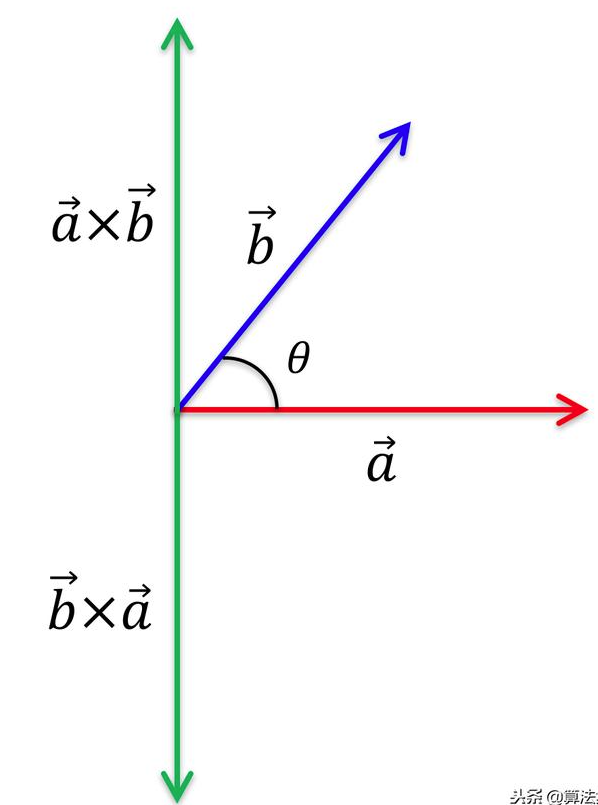
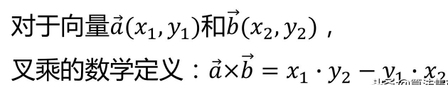
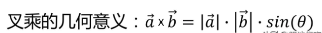
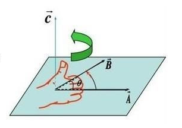
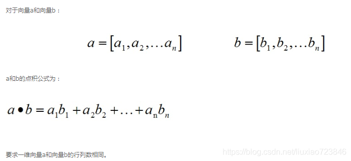
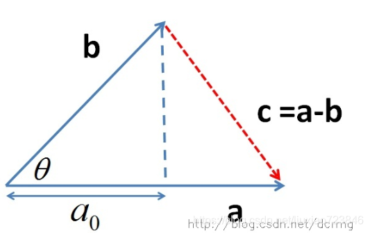

### 叉积
-   

- 向量叉乘的数学定义：  
    
- 向量叉乘的几何定义：  
    
  叉乘的运算结果是一个向量而不是一个标量，上述结果是它的模， 结果向量C的方向与A，B所在的平面垂直，方向用“右手法则”判断。判断方法如下：
- 右手手掌张开，四指并拢，大拇指垂直于四指指向的方向；
- 伸出右手，四指弯曲，四指与A旋转到B方向一致，那么大拇指指向为C向量的方向。  
    


在二维空间中，叉乘还有另外一个几何意义就是：叉积等于由向量A和向量B构成的平行四边形的面积。
- 输出结果为:  $CrossProduct: -3$  
  
- 如图所示，向量 $P1，P2$ 的叉乘就是图中平行四边形的面积 = $3$ ，负号就表示向量 $P1$ 在 $P2$ 的逆时针方向（注：上图 $xy$ 坐标相反）。  

设二维矢量 $P = ( x1, y1 )，Q = ( x2 , y2 ) $ 
- 矢量加法定义为： $P + Q = ( x1 + x2 , y1 + y2 )$  
- 矢量减法定义为： $P  - Q = ( x1  - x2 , y1  - y2 )$  
- 显然有性质 $P + Q = Q + P，P - Q = - ( Q - P )$ 。  
- 矢量的叉积：计算矢量叉积是与直线和线段相关算法的核心部分。设矢量 $P = ( x1, y1 )，Q = ( x2, y2 )$ ，则矢量叉积定义为由$(0,0)、p1、p2 $ 和 $p1+p2$ 所组成的平行四边形的带符号的面积，即：$P × Q = x1*y2 - x2*y1$ ，其结果是一个标量。显然有性质 $P × Q = - ( Q × P ) 和 P × ( - Q ) = - ( P × Q )$ 。
  叉积的另一个非常重要性质是可以通过它的符号判断两矢量相互之间的顺逆时针关系：
  - 若 $P × Q > 0$ , 则 $P$ 在 $Q$ 的顺时针方向。
  - 若 $P × Q < 0$ , 则 $P$ 在 $Q$ 的逆时针方向。
  - 若 $P × Q = 0$ , 则 $P$ 与 $Q$ 共线，但可能同向也可能反向。

### Andrew算法
[LC 587. 安装栅栏](https://leetcode.cn/problems/erect-the-fence/)
```java
class Solution {
    public int[][] outerTrees(int[][] trees) {
        Arrays.sort(trees, (a, b) -> a[0] != b[0] ? a[0] - b[0] : a[1] - b[1]);
        int n = trees.length, top = 0;
        int[] stack = new int[n + 5];
        boolean[] used = new boolean[n + 5];
        stack[top++] = 0; // 起始点不用标记，第二轮（找上壳）时还要使用到
        for (int i = 1; i < n; i++) { // 找下壳
            int[] c = trees[i];
            while (top >= 2) { // 栈中元素必须要有两个及以上才能和c得到两个向量去比较
                int[] a = trees[stack[top - 2]], b = trees[stack[top - 1]];
                // 表明【ab】到【ac】需顺时针旋转（即【ac】在【ab】的右边（顺时针方向）），故ac更外边，将b出栈，让c进去
                if (getArea(a, b, c) < 0) used[stack[--top]] = false;
                else break;
            }
            stack[top++] = i;
            used[i] = true;
        }
        int size = top; // 记录此刻栈中的元素个数（即下壳有多少点）
        for (int i = n - 1; i >= 0; i--) { // 找上壳
            if (used[i]) continue;
            int[] c = trees[i];
            while (top >= size + 1) { // 保证比之前多新增一个点，此时能得到两个点和c组成两个向量
                int[] a = trees[stack[top - 2]], b = trees[stack[top - 1]];
                if (getArea(a, b, c) < 0) used[stack[--top]] = false;
                else break;
            }
            stack[top++] = i;
            // used[i] = true;
        }
        int[][] ans = new  int[top - 1][2]; // 栈中最后一个点和第一个点相同
        for (int i = 0; i < top - 1; i++) {
            ans[i] = trees[stack[i]];
        }
        return ans;
    }

    /**
     * 将两个点转换为一个向量，例如点 a(x1,y1), b(x2,y2) 则转化为向量 a——>b = (x2-x1, y2-y1)
     *
     * @param b 向量终点
     * @param a 向量起始点
     * @return 返回向量 a——>b
     */
    public int[] convertToVector(int[] b, int[] a) {

        return new int[]{b[0] - a[0], b[1] - a[1]};
    }

    /**
     * 求向量【叉积】，输入向量a，向量b，其叉积几何定义等于 axb=|a||b|sinθ，数学定义为 axb=(x1*y2-y1*x2).
     *
     * @param a 输入向量 a
     * @param b 输入向量 b
     * @return 返回向量 axb 的叉积
     */
    public int cross(int[] a, int[] b) {

        return a[0] * b[1] - a[1] * b[0];
    }

    /**
     * 输入三个点，a、b、c，其中a作为起始点，b、c分别为两个向量的终点，将abc三点转化为两个向量【ab】、【ac】，
     * 然后返回【ab】旋转到【ac】这条向量上的面积 s，对于面积 s
     * 1、若 s < 0，表明 【ab】 到 【ac】 需顺时针旋转；
     * 2、若 s > 0，表明 【ab】 到 【ac】 需逆时针旋转；
     * 3、若 s = 0，表明 【ab】 和 【ac】 同处于一个水平线上。
     * 可以使用右手定则自个判断一下（大拇指朝上为正，朝下为负，以大拇指为轴，四个手指垂直于起始向量【ab】然后往【ac】旋转），不清楚可以百度  =|
     *
     * @param a 点 a
     * @param b 点 b
     * @param c 点 c
     * @return 返回向量【ab】和向量【ac】的叉积
     */
    public int getArea(int[] a, int[] b, int[] c) {
        return cross(convertToVector(b, a), convertToVector(c, a));
    }
}
```

### 点积（内积）
向量的点乘，也叫内积，是对两个向量对应位一一相乘之后求和的操作，点乘的结果是一个标量。


- **1）计算公式：**  

 

- **2）几何意义：**


​    1. 表征或计算两个向量之间的夹角  

​    2. b向量在a向量方向上的投影

 
