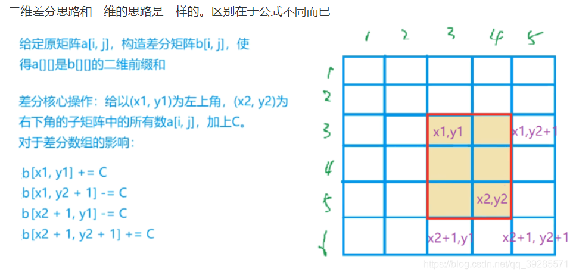
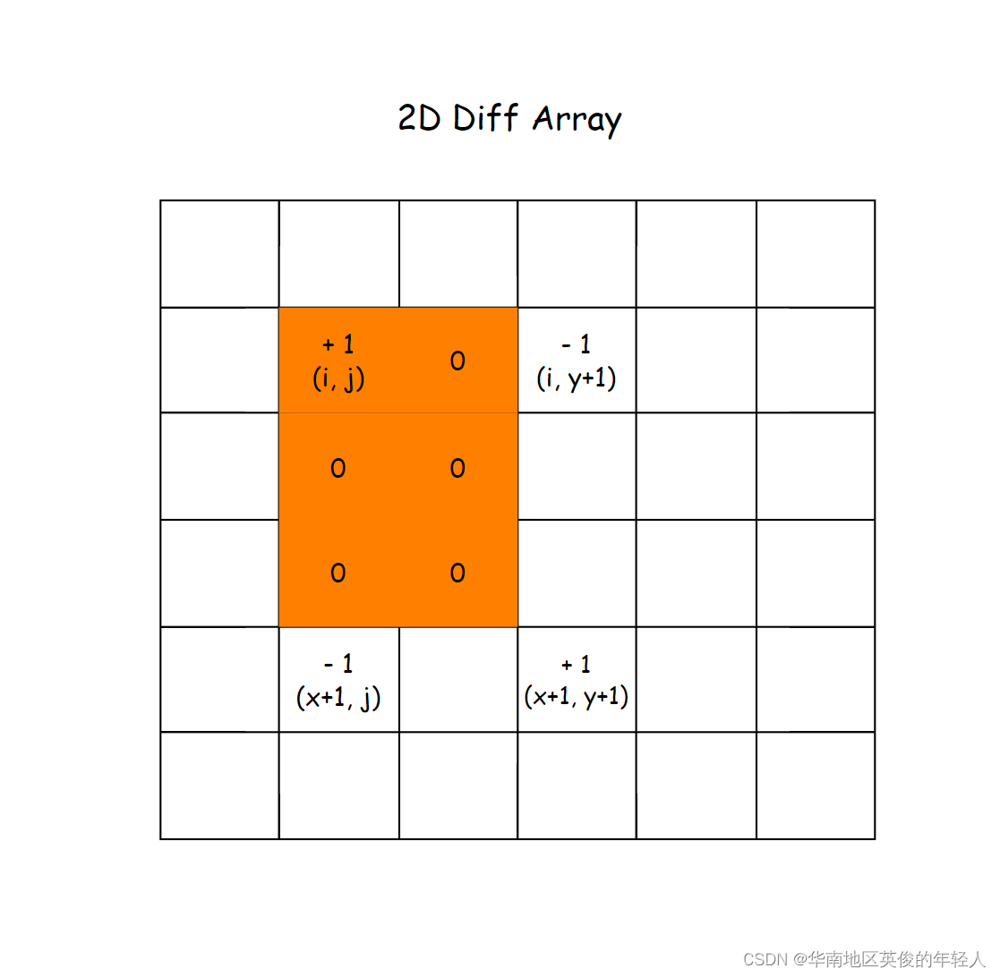
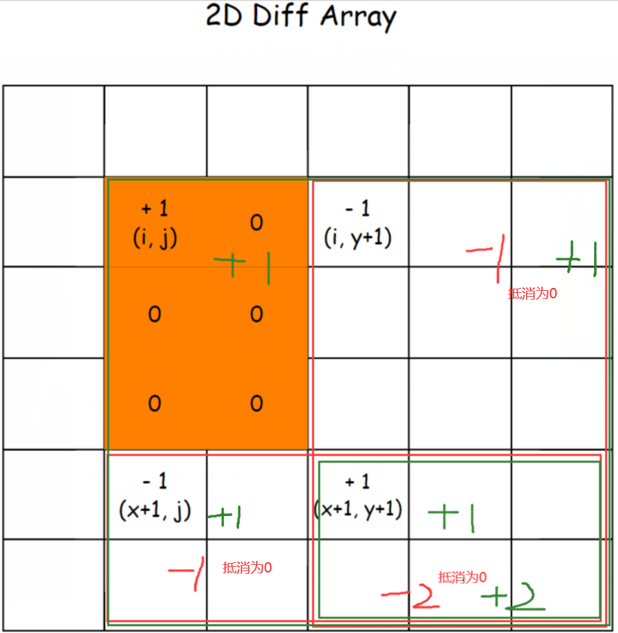

## 差分算法

### 前缀和
差分通常需要和前缀和一起使用才能发挥奇效，所以我们先来介绍一下前缀和。

- 一维前缀和：对于一个长度为 $n$ 的数组 $arr$ , 前缀和数组的定义为 $sum[i + 1] = sum[i] + arr[i]$, 其中 $i∈[0,n)$.

- 二维前缀和：对于一个行数为 $m$ 列数为 $n$ 的二维数组 mat, 定义为 $sum[i + 1][j + 1] = sum[i + 1][j] + sum[i][j + 1] - sum[i][j] + mat[i][j]$, 其中 $i∈[0,m),j∈[0,n)$.

- 前缀和的作用：对于求出的一维前缀和，我们可以在 $O(1)$ 的时间复杂度内求出数组中任意子数组的和，对于下标在 $[i,j]$ 的子数组，其和为 $sum[j + 1] - sum[i]$.

- 映射到二维空间，则可以通过二维的前缀和数组求出任意一个矩形区域对应的和，即原数组中左上角 $(i,\ j)$ 与右下角 $(x,\ y)$ 确定的矩形区域，对应的值总和为 $sum[x + 1][y + 1] - sum[x + 1][j] - sum[i][y + 1] + sum[i][j]$.

### 差分
**差分就是前缀和的逆过程!!!**

#### 一维差分
- 差分数组的作用是可以利用 线性时间 来处理 区间修改问题.

- 例如存在一个二维数组 $req$，对于每一个 $r = req[i]$， 需要将 $arr$ 数组中下标在 $[r[0], r[1]]$ 间的元素都加上 $r[2]$, 那么此时差分数组就具备很好的使用场景，具体的代码模板如下：
```java
void template1d(int[][] req, int[] arr) {
    int n = arr.length;
    int[] diff = new int[n + 1]; // 差分数组一般多开一维（供最后一位-d操作）
    for (int[] re : req) {
        int d = re[2];
        diff[re[0]] += d;
        diff[re[1] + 1] -= d;
    }
    arr[0] += diff[0];
    for (int i = 1; i < n; i++) {
        diff[i] += diff[i - 1]; // 求前缀和操作
        arr[i] += diff[i];
    }
}
```
封装成函数为：
```java
// a[]：原数组（前缀和数组），b[]: 差分数组；
// 操作：区间 [l,r] 每个数都加上 d
void insert(int l, int r, int d) {
    b[l] += d;
    b[r + 1] -= d;
}
```
- 注意：区间处理 加减 问题也可以使用树状数组或线段树，但是代码量上远远不如差分数组，后两者适用于更高级的使用场景

求前缀和：
```java
void calculate() {
    int[] sums = new int[n + 1];
    for (int i = 1; i <= n; i++) {
        sums[i] = sums[i - 1] + arr[i - 1];
    }
}
```

#### 二维差分
- 二维差分无非就是把一维差分的性质映射到了二维平面，适用场景变成了：二维数组中的子矩阵修改问题



- 举个栗子：对于一个 全 $0$ 的 $m * n$ 数组，若想将原数组中 $(i - 1, j - 1)$ 与 $(x - 1, y - 1)$ 所确定的矩形中的元素都加上 $1$, 那么在差分数组上的操作为下图所示:



- 具体操作如下图，两块红色区域都 $-d$，绿色区域都 $+d$ .



操作代码如下：
```java
// a[]：原数组（前缀和数组），b[]：差分数组
// 操作：将 [x1,y1]至[x2,y2]内的每个元素加上 d
void insert(int x1, int y1, int x2, int y2, int d) {
    b[x1][y1] += d;
    b[x1][y2 + 1] -= d;
    b[x2 + 1][y1] -= d;
    b[x2 + 1][y2 + 1] += d;
}
```

模板：
```java
void template2d(int[][] req, int[][] arr) {
    int m = arr.length, n = arr[0].length;
    int[][] diff = new int[m + 2][n + 2]; // 行数和列数都多开2, 以便前缀和的计算（0和n+1维度不用）
    for (int[] re : req) {
        int x1 = re[0], y1 = re[1], x2 = re[2], y2 = re[3], d = re[4];
        diff[x1][y1] += d;
        diff[x1][y2 + 1] -= d;
        diff[x2 + 1][y1] -= d;
        diff[x2 + 1][y2 + 1] += d;
    }
    // 求前缀和
    for (int i = 1; i <= m; i++) {
        for (int j = 1; j <= n; j++) {
            diff[i][j] += diff[i - 1][j] + diff[i][j - 1] - diff[i - 1][j - 1];
            arr[i - 1][j - 1] += diff[i][j];
        }
    }
}
```

求前缀和：
```java
void calculate() {
    int[][] sums = new int[m + 1][n + 1], diffs = new int[m + 2][n + 2]; // 前缀和数组、差分数组
    for (int i = 1; i <= m; i++) { // 求 grid 数组的 （初始化）前缀和数组
        for (int j = 1; j <= n; j++) {
            sums[i][j] = sums[i - 1][j] + sums[i][j - 1] - sums[i - 1][j - 1] + grid[i - 1][j - 1];
        }
    }
}
```

### 练习题
| 题目                                                                                          | 标签      |
|:--------------------------------------------------------------------------------------------|:--------|
| [LC 2132. 用邮票贴满网格图](https://leetcode.cn/problems/stamping-the-grid/)                        | 二维差分    |
| [LC 1589. 所有排列中的最大和](https://leetcode.cn/problems/maximum-sum-obtained-of-any-permutation/) | 一维差分    |
| [LC 1109. 航班预订统计](https://leetcode.cn/problems/corporate-flight-bookings/)                  | 一维差分    |
| [AcWing P797 差分](https://www.acwing.com/activity/content/797/)                              | 一维差分    |
| [AcWing P798 差分矩阵](https://www.acwing.com/activity/content/798/)                            | 二维差分    |
| [XDOJ P1276 Music List](https://acm.xidian.edu.cn/problem.php?id=1276)                      | 一维差分    |
| [XDOJ P1378 火聚聚的music list](https://acm.xidian.edu.cn/problem.php?id=1378)                  | 二维差分    |
| [HDOJ P6186 CS Course](http://acm.hdu.edu.cn/showproblem.php?pid=6186)                      | 前缀和+后缀和 |

### 参考资料
[基本算法——差分](https://blog.csdn.net/qq_39285571/article/details/106304666)
[前缀和与差分数组 (一维和二维)](https://blog.csdn.net/weixin_43876403/article/details/122419721)
[差分_(模板)](https://blog.csdn.net/weixin_44828107/article/details/104187680)