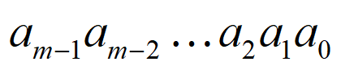
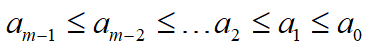
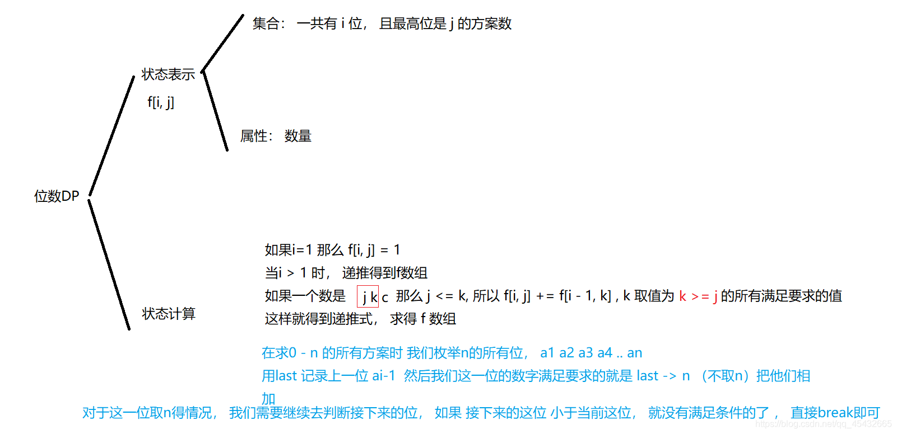
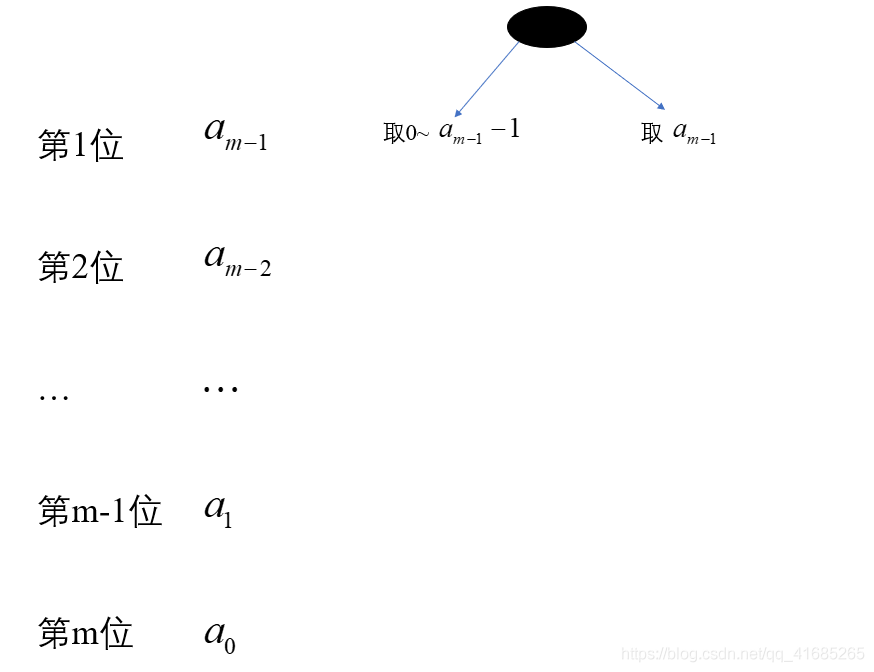
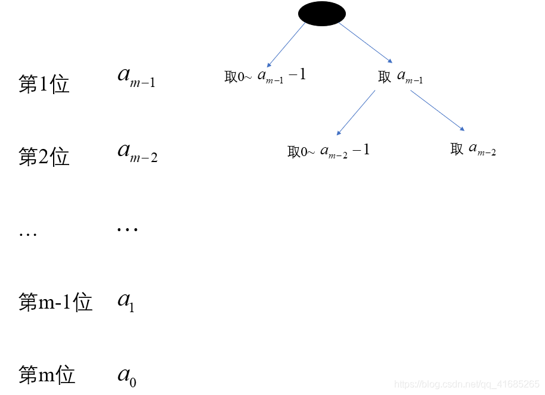

### 数位DP

#### 引入
- 数位DP用来解决什么问题？

​        求出在给定区间 $[L,R] $内，符合条件 $f(i)$ 的数 $i$ 的个数。条件 $f(i)$ 一般与数的大小无关，而与数的组成有关。由于数是按位 $dp$ ，数的大小对复杂度的影响很小。

- 朴素解法：
    ```java
    for (int i = l; i <= r; i++) {
        if (check(i)) ans++;
    }
    ```
    ​        其中 `check` 函数是检验是否满足要求，`ans` 是总个数，这样求解很容易超时，比如 l$ = 1，r = 1e9$，时间上肯定是过不去的，于是我们就要考虑如何优化这个问题了。

- 两个优化思想：
  1. 思想1：用 $f(x)$ 表示不大于 $x$ 的数中满足要求的个数，这样最后的结果可以表示为：$f(r) - f(l-1)$
  2. 思想2：用一棵树的形式来理解

  ​         这里说的可能有点抽象了，我们以一道题目为例：**给定一个区间 $[l.r]$ ，找到这个区间上所有的“不减数”，不减数定义为从高位到低位数字大小是不减的，比如：$223,669,456$等等**

  ​        那么这道题目我们首先使用第一个思想，假设 $dp(n)$ 为区间 $[0,n]$ 上的不减数的个数，那么最后的结果应该是$dp(r) - dp(l-1)$ ，下边我们来详细介绍一下第二个优化思想，我们将数字n各位上的数字从高位到低位排列，如下图所示：
  



  ​             我们很容易能够理解，题目中要求的数实际上满足：



​        我们假设：$f[i,j]$ 表示长度为 $i$ ，最高位为 $j$ 的数中，不降数的个数，如下图，所以我们有代码



```java
void init() {
    // 长度为1的个数只有一个
    for (int i = 0; i <= 9; i++) f[1][i] = 1;
    // 长度大于1时
    for (int i = 2; i < maxn; i++) {
        // 枚举开头元素
        for (int j = 0; j <= 9; j++) {
            for (int k = j; k <= 9; k++) {
                // 将以 k 开头，长度为 i - 1 的数放在数字 j 后面形成不降数
                f[i][j] += f[i - 1][k];
            }
        }
    }    
}
```

​        下边我们考虑数位，我们将这个数字竖着来写，当我们选择数字时，比如当 $n=5863$ 时，那么最高位就是 $5$，很明显我们只能取 $0\sim5$，下边我们将分两种情况，第一种是取 $0\sim 4$，此时只要以 $0\sim4$ 开头的所有数是存在的，于是 $f[m][0\sim4]$ 就是该部分的不降数个数；对于另一种情况，最高位取了 $5$ ，那么下一位并不能取遍 $0\sim 9$，所以需要再做一次分类。



​        如下图所示，当第二位取 $0\sim7$ 时，那么后边的数字可以取遍 $0\sim9$，所以满足条件个数为 $f[m-1,0\sim7]$，对于取 $8$ 的情况，还要继续分情况，到这里就很清楚的说明为什么数位 $DP$ 可以用一颗树来形象说明了，中间过程是递归的，下边我给出解题代码：

​														    

#### 实现

##### 模板一（迭代法）

代码：

```java
import java.util.ArrayList;
import java.util.List;
import java.util.Scanner;

public class Main {
    static int maxn = 15;
    static int[][] f = new int[maxn][10]; // f[i][j]表示长度为i，最高位为j的不降数个数

    public static void main(String[] args) {
        Scanner scan = new Scanner(System.in);
        int l = scan.nextInt(), r = scan.nextInt();
        System.out.println(dp(r) - dp(l - 1));
    }

    static void init() { // 初始化
        // 长度为1的个数只有一个
        for (int i = 0; i <= 9; i++) f[1][i] = 1;
        // 长度大于1时
        for (int i = 2; i < maxn; i++) {
            for (int j = 0; j <= 9; j++) { // 枚举开头元素
                for (int k = j; k <= 9; k++) {
                    // 将以k开头，长度为i - 1的数放在数字j后边形成新的不降数
                    f[i][j] += f[i - 1][k];
                }
            }
        }
    }

    static int dp(int n) {
        if (n == 0) return 1;
        List<Integer> nums = new ArrayList<>();
        while (n != 0) {
            nums.add(n % 10);
            n /= 10;
        }
        int res = 0, last = 0; // res为方案数，last为保留一些前缀信息（本体为上一个数）
        // 从最大数开始枚举
        for (int i = nums.size() - 1; i >= 0; i--) {
            int cur = nums.get(i); // 当前这位数
            // 要保障比下一位 >= 上一位，所以从last开始枚举,最多枚举到 cur, 
            // last为上一位，也即最高位，对下一位的枚举是有限制的
            for (int j = last; j < cur; j++) { // 遍历左子树
                res += f[i + 1][j]; // 左端的节点有 i+1 位数（i开始下标为0）
            }
            if (cur < last) break; // 如果当前这位数比上一位小，后面的数都不成立了，直接break
            last = cur;
            if (i == 0) res++; // 如果能顺利到达最后一个数，说明这个数本身的最右边这一段的每一个数都是小于等于前一位数的，因而++
        }
        return res;
    }
}
```

##### 模板二（记忆化搜索）

代码

```java
import java.util.Arrays;
import java.util.Scanner;

public class Main {
    static int N = 15;
    static int[] arr = new int[N];
    static int[][] dp = new int[N][10];

    public static void main(String[] args) {
        Scanner scan = new Scanner(System.in);
        int l = scan.nextInt(), r = scan.nextInt();
        System.out.println(solve(r) - solve(l - 1));
    }

    public static int solve(int n) {
        for (int[] ints : dp) Arrays.fill(ints, -1);
        int pos = 0;
        while (n != 0) {
            arr[pos++] = n % 10;
            n /= 10;
        }
        return dfs(pos - 1, 0, true);
    }

    public static int dfs(int pos, int pre, boolean limit) {
        if (pos < 0) return 1; // 遍历完了最后一位，表明这个数本身也是合法的，返回1
        if (dp[pos][pre] != -1 && !limit) return dp[pos][pre]; 
        if (dp[pos] != -1 && !limit) return dp[pos];
        int res = 0, up = limit ? arr[pos] : 9;
        for (int i = 0; i <= up; i++) {
            if (i < pre) continue;
            res += dfs(pos - 1, i, i == up && limit);
        }
        if (!limit) dp[pos][pre] = res;
        return res;
    }
}
```

#### 记忆化搜索实现
##### 记搜过程
​        从起点（最高位）向下搜索，到最底层得到方案数，一层一层向上返回答案并累加，最后从搜索起点得到最终答案。

​        对于 $[l,r]$ 区间问题，我们一般把他转化为两次数位 $dp$ ,即找 $[0,r]$ 和 $[0,l-1]$ 两段，再将结果相减就得到了我们需要的 $[l,r]$ 。

##### 状态设计
​        如果理解了上述过程，我们需要考虑的就是怎样判断现在在哪一层，怎样判断当前的状态——这就需要我们传进一些参量。

​        **$dfs$函数需要哪些参量？**
> 1. 首先是数位 $dp$ 基本的量数字位数 $pos$，记录答案的 $st$，最高位限制 $limit$（这个后面会讲）
> 2. 我们还需要一个判断判断前导 $0$ 的标记 $lead$（这个后面也会讲）
> 3. 由于数位 $dp$ 解决的大多是数字组成问题，所以经常要比较当前位和前一位或前几位的关系（根据题意而定），所以一般在 $dfs()$ 中也要记录前一位或前几位数 $pre$ 方便比较。
> 4. 除此之外还可以传进更多参量以区分状态，视题意而定。

​        数位 $dp$ 的状态能记录的最好都记录上。

##### 细节分析
###### 一、前导 $0$ 标记 $lead$

​        由于我们要搜的数可能很长，所以我们直接从最高位搜起；

​        举个例子：假如我们要从 $[0,1000]$ 找任意相邻两数相等的数；

​        显然 $111,222,888$ 等等是符合题意的数

​        但是我们发现右端点$1000$ 是四位数

​        因此我们搜索的起点是 $0000$，而三位数的记录都是 $0111,0222,0888$ 等等

​        而这种情况下如果我们直接找相邻位相等则 $0000$ 符合题意而 $0111,0222,0888$ 都不符合题意了

​        所以我们要加一个前导 $0$ 标记

  > 1. 如果当前位 $lead=1$ 而且当前位也是 $0$，那么当前位也是前导 $0$ ，$pos+1$ 继续搜；
  > 2. 如果当前位 $lead=1$ 但当前位不是 $0$，则本位作为当前数的最高位，$pos+1$ 继续搜；（注意这次根据题意 $st$ 或其他参数可能发生变化）

​        当然前导 $0$ 有时候是不需要判断的，上述的例子是一个有关数字结构上的性质，$0$ 会影响数字的结构，所以必须判断前导 $0$；而如果我们研究的是数字的组成（例如这个数字有多少个 $1$ 之类的问题），$0$ 并不影响我们的判断，这样就不需要前导 $0$ 标记了。总之，这个因题而异，并不是必须要标记（当然记了肯定是不会出错的）。

​        前导零问题：

​        是否需要特殊处理前导0这个需要根据前导0的存在是否会影响题目的性质。在 [牛客 数位小孩] 题目会影响比如说如果你把 0012 和 12 看成一样的就会有影响，因为在0012 中0 + 0 == 0不是质数所以不符合，而 12 中1 + 2 == 3符合。

​        在AcWing - 1082.数字游戏 中是没有影响的因为 0012 和 12 都是不降数，0不会对后面有影响。

###### 二、最高位标记 $limit$
​        我们知道在搜索的数位搜索范围可能发生变化；

​        举个例子：我们在搜索 $[0,555]$ 的数时，显然最高位搜索范围是 0~5 ，而后面的位数的取值范围会根据上一位发生变化：

 > 1. 当最高位是 1~4 时，第二位取值为 $[0,9]$ ;
 > 2. 当最高位是 5 时，第二位取值为 $[0,5]$（再往上取就超出右端点范围了）

​        为了分清这两种情况，我们引入了 $limit$ 标记：

 > 1. 若当前位 $limit=1$ 而且已经取到了能取到的最高位时，下一位 $limit=1$；
 > 2. 若当前位 $limit=1$ 但是没有取到能取到的最高位时，下一位l $limit=0$ ；
 > 3. 若当前位 $limit=0$ 时，下一位 $limit=0$。

​       我们设这一位的标记为 $limit$，这一位能取到的最大值为 $res$，则下一位的标记就是 $i==res\&\&limit$（ $i$ 枚举这一位填的数）

###### 三、$dp$ 值的记录和使用
​        最后我们考虑 $dp$ 数组下标记录的值

​        本文介绍数位 $dp$ 是在记忆化搜索的框架下进行的，每当找到一种情况我们就可以这种情况记录下来，等到搜到后面遇到相同的情况时直接使用当前记录的值。

​        $dp$ 数组的下标表示的是一种状态，只要当前的状态和之前搜过的某个状态完全一样，我们就可以直接返回原来已经记录下来的 $dp$ 值。

​        再举个例子

​        假如我们找 $[0,123456]$ 中符合某些条件的数

​        假如当我们搜到 $1000??$ 时，$dfs$ 从下返上来的数值就是当前位是第 $5$ 位，前一位是 $0$ 时的方案种数，搜完这位会向上反，这是我们可以记录一下：当前位第 $5$ 位，前一位是 $0$ 时，有这么多种方案种数

​        当我们继续搜到 $1010??$ 时，我们发现当前状态又是搜到了第 $5$ 位，并且上一位也是 $0$ ，这与我们之前记录的情况相同，这样我们就可以不继续向下搜，直接把上次的 $dp$ 值返回就行了。

​        注意，我们返回的 $dp$ 值必须和当前处于完全一样的状态，这就是为什么 $dp$ 数组下标要记录 $pos,pre$ 等参量了。

最重要的来了————————————————————

​        接着上面的例子，范围 $[0,123456]$ 

​        如果我们搜到了 $1234??$，我们能不能直接返回之前记录的：当前第55位，前一位是44时的dp值？

​        答案是否定的

​        我们发现，这个状态的 $dp$ 值被记录时，当前位也就是第 $5$ 位的取值是 $[0,9]，$ 而这次当前位的取值是 $[0,5]$，方案数一定比之前记录的 $dp$ 值要小。

​        当前位的取值范围为什么会和原来不一样呢？

​        如果你联想到了之前所讲的知识，你会发现：现在的 $limit=1$，最高位有取值的限制。

​        因此我们可以得到一个结论：当 $limit=1$ 时，不能记录和取用 $dp$ 值！

​        类似上述的分析过程，我们也可以得出：当 $lead=1$ 时，也不能记录和取用 $dp$ 值！

以上就是计划搜索的完整步骤。

附图：


##### 模板
```c++
ll dfs(int pos,int pre,int st,……,int lead,int limit) // 记搜
{
    if(pos > len) return st; // 剪枝
    if((dp[pos][pre][st]……[……] != -1 && (!limit) && (!lead))) return dp[pos][pre][st]……[……]; // 记录当前值
    ll ret = 0; // 暂时记录当前方案数
    int res = limit?a[len-pos+1]:9; // res当前位能取到的最大值（上界）
    for(int i = 0;i <= res;i++)
    {
        // 有前导0并且当前位也是前导0
        if((!i) && lead) ret += dfs(……,……,……,i == res && limit); // 注意：i == arr[pos]判断上界也可
        // 有前导0但当前位不是前导0，当前位就是最高位
        else if(i && lead) ret += dfs(……,……,……,i == res && limit); 
        else if(根据题意而定的判断) ret += dfs(……,……,……,i == res && limit);
    }
    if(!limit && !lead) dp[pos][pre][st]……[……] = ret; // 当前状态方案数记录
    return ret;
}

ll part(ll x) // 把数按位拆分
{
    len = 0;
    while(x) a[len++] = x % 10, x /= 10;
    memset(dp, -1, sizeof dp);// 初始化-1（因为有可能某些情况下的方案数是0）
    return dfs(len - 1,……,……,true);// 进入记搜
}

int main()
{
    scanf("%d", &T);
    while(T--)
    {
        scanf("%lld%lld",&l, &r);
        if(l) printf("%lld", part(r) - part(l-1)); // [l,r](l!=0)
        else printf("%lld", part(r) - part(l)); // 从0开始要特判
    }
    return 0;
}
```

​        记忆化为什么是 $if(!limit)$ 才行，大致就是说有无 $limit$ 会出现状态冲突，举例：
> 约束：数位上不能出现连续的两个 $1$ ( $11、112、211$ 都是不合法的)
>
> 假设就是 $[1,210]$ 这个区间的个数
> 
> 状态: $dp[pos][pre]$:当前枚举到 $pos$ 位，前面一位枚举的是 $pre$ (更加前面的位已经合法了)的个数(我的 $pos$ 从0开始)
> 
> 先看错误的方法计数，就是不判 $limit$ 就是直接记忆化
> 
> 那么假设我们第一次枚举了百位是 $0$，显然后面的枚举 $limit=false$，也就是数位上 $0到9$ 的枚举，然后当我十位枚举了 $1$，此时考虑 $dp[0][1]$ ,就是枚举到个位，前一位是 $1$ 的个数，显然 $dp[0][1]=9$;(个位只有是 $1$ 的时候是不满足的)，这个状态记录下来，继续 $dfs$，一直到百位枚举了 $2$，十位枚举了 $1$，显然此时递归到了 $pos=0,pre=1$ 的层，而 $dp[0][1]$ 的状态已经有了即$dp[pos][pre]!=-1$ ；此时程序直接 $return dp[0][1]$ 了，然而显然是错的，因为此时是有 $limit$ 的个位只能枚举 $0$，根本没有 $9$个数，这就是状态冲突了。有 $lead$ 的时候可能出现冲突，这只是两个最基本的不同的题目可能还要加限制，反正宗旨都是让 $dp$ 状态唯一；
> 
> 对于这个错误说两点：一是 $limit$ 为 $true$ 的数并不多，一个个枚举不会很浪费时间，所以我们记录下 $! limit$ 的状态解决了不少子问题重叠。第二，有人可能想到把 $dp$ 状态改一下 $dp[pos][state][limit]$ 就是分别记录不同 $limit$ 下的个数，这种方法一般是对的，关于这个具体会讲，下面有题 [bzoj 3209]() 会用到这个。
> 
> 数位的部分就是这些，然后就是难点，$dp$ 部分。
> 
> 既然从高位往低位枚举，那么状态一般都是与前面已经枚举的数位有关并且通常是根据约束条件当前枚举的这一位能使得状态完整(比如一个状态涉及到连续 $k$ 位，那么就保存前 $k-1$ 的状态，当前枚举的第 $k$ 个是个恰好凑成成一个完整的状态，不过像那种状态是数位的和就直接保存前缀和为状态了)，不过必然有一位最简单的一个状态 $dp[pos]$ 当前枚举到了 $pos$ 位。$dp$ 部分就要开始讲例题了，不过会介绍几种常用防 $tle$ 的优化。


#### 例题
| 题目                                                                                       |                                           标签                                           |
|:-----------------------------------------------------------------------------------------|:--------------------------------------------------------------------------------------:|
| [LOJ 10164. 数字游戏](https://loj.ac/p/10164)                                                |                                    迭代法、记忆化搜索（无前导零）                                     |
| [HDOJ 2089.不要62](http://acm.hdu.edu.cn/showproblem.php?pid=2089)                         |                                    记忆化搜索、迭代法（无前导零）                                     |
| [POJ NOI0105-40 数1的个数](http://noi.openjudge.cn/ch0105/40/)                               |                                   记忆化搜索、迭代计算法（无前导零）                                    |
| [LightOJ P1032 Fast Bit Calculations](https://lightoj.com/problem/fast-bit-calculations) |                            迭代法、记忆化搜索（无前导零）<br>按二级制位存储进行数位dp                            |
| [LuoGu P2657 [SCOI2009] windy 数](https://www.luogu.com.cn/problem/P2657)                 |                                    记忆化搜索、迭代法（有前导零）                                     |
| [LuoGu P2602 [ZJOI2010] 数字计数](https://www.luogu.com.cn/problem/P2602)                    |                                      记忆化搜索（有前导零）                                       |
| [LuoGu P3413 SAC#1 - 萌数](https://www.luogu.com.cn/problem/P3413)                         | 记忆化搜索（有前导零）<br>位数最大到1000，以字符串读入，并且关联到前两位<br>**注意：dfs记忆化时，函数里的所有参数都必须关联到才能记忆化，否则一定会漏解** |

**！！！注意：迭代法先初始化递推时，别忘了要调用 $init()$ 方法。**

#### 参考资料
[1.数位DP，看这一篇就足够了！](https://yuqi-cheng.blog.csdn.net/article/details/106889377)  
[2.数位dp总结 之 从入门到模板](https://blog.csdn.net/jk211766/article/details/81474632)  
[3.数字组成的奥妙——数位dp](https://www.luogu.com.cn/blog/virus2017/shuweidp)   
[4.简单数位dp及对前导0的理解](https://blog.csdn.net/weixin_52193673/article/details/123145949)