## 博弈论
有一种很有意思的游戏，就是有物体若干堆，可以是火柴棍或是围棋子等等均可。两个 人轮流从堆中取物体若干，规定最后取光物体者取胜。这是我国民间很古老的一个游戏 ，别看这游戏极其简单，却蕴含着深刻的数学原理。下面我们来分析一下要如何才能够取胜。  
[原理](https://www.cnblogs.com/zwx7616/p/10896848.html)  
[代码](https://blog.csdn.net/lesileqin/article/details/98525887)  
### 巴什博奕（Bash Game）
只有一堆```n```个物品，两个人轮流从这堆物品中取物，规定每次至少取一个，最多取```m```个。最后取光者得胜。  
- 显然，如果```n=m+1```，那么由于一次最多只能取```m```个，所以，无论先取者拿走多少个，后取者都能够一次拿走剩余的物品，后者取胜。因此我们发现了如何取胜的法则：如果```n=(m+1)*r+s```，（```r```为任意自然数，```s≤m```),那么先取者要拿走```s```个物品，如果后取者拿走 ```k(≤m)```个，那么先取者再拿走```m+1-k```个，结果剩下```(m+1)*(r-1)```个，以后保持这样的取法，那么先取者肯定获胜。总之，要保持给对手留下```(m+1)```的倍数，就能最后获胜。  
- 这个游戏还可以有一种变相的玩法：两个人轮流报数，每次至少报一个，最多报十 个，谁能报到100者胜。 
- 代码：
    ```java
    public void bashGame(int n, int m) {
        if (n % (m + 1) == 0) 
            System.out.println("先手必败");
        else 
            System.out.println("先手必胜");  // 将 (m+1) 的倍数留给对手
    }
    ```
### 威佐夫博奕（Wythoff Game）
有两堆各若干个物品，两个人轮流从某一堆或同时从两堆中取同样多的物品，规定每次至少取一个，多者不限，最后取光者得胜。  
- 这种情况下是颇为复杂的。我们用（a<sub>k</sub> ，b<sub>k</sub>）（a<sub>k</sub> ≤ b<sub>k</sub> ,k=0，1，2，…,n)表示两堆物品的数量并称其为局势，如果甲面对（0，0），那么甲已经输了，这种局势我们称为奇异局势。前几个奇异局势是：（0，0）、（1，2）、（3，5）、（4，7）、（6，10）、（8，13）、（9，15）、（11，18）、（12，20）。  
- 可以看出,a<sub>0</sub>=b<sub>0</sub>=0,a<sub>k</sub>是未在前面出现过的最小自然数,而 b<sub>k</sub>= a<sub>k</sub> + k，奇异局势有如下三条性质：  
  > 1. 任何自然数都包含在一个且仅有一个奇异局势中。  
     由于a<sub>k</sub>是未在前面出现过的最小自然数，所以有a<sub>k</sub> > a<sub>k-1</sub> ，而 b<sub>k</sub>= a<sub>k</sub> + k > a<sub>k-1</sub> + k-1 = b<sub>k-1</sub> > a<sub>k-1</sub> 。所以性质1。成立。
  > 2. 任意操作都可将奇异局势变为非奇异局势。  
     事实上，若只改变奇异局势（a<sub>k</sub>，b<sub>k</sub>）的某一个分量，那么另一个分量不可能在其他奇异局势中，所以必然是非奇异局势。如果使（a<sub>k</sub>，b<sub>k</sub>）的两个分量同时减少，则由于其差不变，且不可能是其他奇异局势的差，因此也是非奇异局势。
  > 3. 采用适当的方法，可以将非奇异局势变为奇异局势。  
     > - 假设面对的局势是（a,b），若 b = a，则同时从两堆中取走 a 个物体，就变为了奇异局势（0，0）；  
     > - 如果a = a<sub>k</sub> ，b > b<sub>k</sub>，那么，取走b  – b<sub>k</sub>个物体，即变为奇异局势；  
     > - 如果 a = a<sub>k</sub> ，  b < b<sub>k</sub> ,则同时从两堆中拿走 a<sub>k</sub> – ab + a<sub>k</sub>个物体,变为奇异局势（ a<sub>b</sub> – a<sub>k</sub> , a<sub>b</sub> – a<sub>k</sub>+ b – a<sub>k</sub>）；  
     > - 如果a > a<sub>k</sub> ，b= a<sub>k</sub> + k,则从第一堆中拿走多余的数量a – a<sub>k</sub> 即可；如果a < a<sub>k</sub> ，b= a<sub>k</sub> + k,分两种情况，第一种，a=a<sub>j</sub> （j < k）,从第二堆里面拿走 b – b<sub>j</sub> 即可；第二种，a=b<sub>j</sub> （j < k）,从第二堆里面拿走 b – a<sub>j</sub> 即可。  

- 从如上性质可知，两个人如果都采用正确操作，那么面对非奇异局势，先拿者必胜；反之，则后拿者取胜。  
- 那么任给一个局势（a，b），怎样判断它是不是奇异局势呢？我们有如下公式：
   $$
   a_k =[k（1+√5）/2]，b_k= a_k + k  (k=0，1，2，…,n 方括号表示取整函数) 
   $$
- 奇妙的是其中出现了黄金分割数（1+√5）/2 = 1。因此,由a<sub>k</sub>，b<sub>k</sub>组成的矩形近似为黄金矩形，由于2/（1+√5）=（√5-1）/2，可以先求出j=[a（√5-1）/2]，若a=[j（1+√5）/2]，那么a = a<sub>j</sub>，b<sub>j</sub> = a<sub>j</sub> + j，若不等于，那么a = a<sub>j+1</sub>，b<sub>j+1</sub> = a<sub>j+1</sub>+ j + 1，若都不是，那么就不是奇异局势。然后再按照上述法则进行，一定会遇到奇异局势。 
- 代码：
    ```java
    // 先求出差， 差值*黄金分割比==最小者 后手赢、否则先手赢
    public void wythoffGame(int n1, int n2) {
        double r = (Math.sqrt(5) + 1) / 2; // 黄金分割比
        int k = Math.abs(n1 - n2); // ak, bk=ak + k
        int ak = k * r; // 求出 ak
        if (d == Math.min(n1, n2)) System.out.println("先手必败"); // 出现(ak,bk)奇异局势（必败局势），则先手必败
        else System.out.println("先手必胜");
    }
    ```

### 尼姆博奕（Nimm Game）
有三堆各若干个物品，两个人轮流从某一堆取任意多的物品，规定每次至少取一个，多者不限，最后取光者得胜。
- 这种情况最有意思，它与二进制有密切关系，我们用（a，b，c）表示某种局势，首先（0，0，0）显然是奇异局势，无论谁面对奇异局势，都必然失败。第二种奇异局势是（0，n，n），只要与对手拿走一样多的物品，最后都将导致（0，0，0）。仔细分析一下，（1，2，3）也是奇异局势，无论对手如何拿，接下来都可以变为（0，n，n）的情形。
- 计算机算法里面有一种叫做按位模2加，也叫做异或的运算，我们用符号 ⊕ 表示这种运算。这种运算和一般加法不同的一点是1 ⊕ 1=0。先看（1，2，3）的按位模2加的结果：
  > 1 =二进制01  
    2 =二进制10  
    3 =二进制11  ⊕   
    ———————  
    0 =二进制00 （注意不进位）  
- 对于奇异局势（0，n，n）也一样，结果也是0。  
- 任何奇异局势（a，b，c）都有a ⊕ b ⊕ c =0。  
- 到此：
    > 1.a1 ⊕ a2 ⊕ a3 ...  ⊕ an != 0 必胜态  
      2.a1 ⊕ a2 ⊕ a3 ...  ⊕ an == 0 必败态  
- 性质：
    > 1. **必败态只能转移到必胜态**  *（即当前为必败态，不管如何操作，操作完后，下一步就转移到了必胜态）*  
    > 2. **必胜态总能转移到某个必败态**   *（即当前为必胜态，可以通过某些操作，使得操作完后下一步就转移到了必败态（留给对手））*  
- 如果我们面对的是一个非奇异局势（a，b，c），要如何变为奇异局势呢？假设 a < b < c,我们只要将 c 变为 a ⊕ b,即可,因为有如下的运算结果: a ⊕ b ⊕ (a ⊕ b)=(a ⊕ a) ⊕ (b ⊕ b)=0 ⊕ 0=0。要将c 变为a ⊕ b，只要从 c中减去 c-（a ⊕ b）即可。
- 举例： 
  > - 例1 （14，21，39），14 ⊕ 21=27，39-27=12，所以从39中拿走12个物体即可达到奇异局势（14，21，27）。
  > - 例2 （55，81，121），55 ⊕ 81=102，121-102=19，所以从121中拿走19个物品就形成了奇异局势（55，81，102）。
  > - 例3 （29，45，58），29 ⊕ 45=48，58-48=10，从58中拿走10个，变为（29，45，48）。
  > - 例4 我们来实际进行一盘比赛看看：
         甲:(7,8,9)->(1,8,9)奇异局势  
         乙:(1,8,9)->(1,8,4)  
         甲:(1,8,4)->(1,5,4)奇异局势  
         乙:(1,5,4)->(1,4,4)  
         甲:(1,4,4)->(0,4,4)奇异局势  
         乙:(0,4,4)->(0,4,2)  
         甲:(0.4,2)->(0,2,2)奇异局势  
         乙:(0,2,2)->(0,2,1)  
         甲:(0,2,1)->(0,1,1)奇异局势  
         乙:(0,1,1)->(0,1,0)  
         甲:(0,1,0)->(0,0,0)奇异局势  
         甲胜。
- 代码：
    ```java
    public void nimmGame(int[] ns) {
        int res = 0;
        for (int n : s) res ^= n;
        if (res == 0) System.out.println("先手必败"); // 此时为奇异局势，则当前先手的人必败
        else System.out.println("先手必胜"); // 非奇异局势，则可将奇异局势留给对手，故先手必胜
    }
    ```

### 斐波那契博弈（Fibonacci Game）
一共n个物品，两人轮流取出1~任意个，但是不能取完，以后每次取的物品都不能超过上一次的2倍（包含1和对手刚取的石子数的2倍），最后取完者胜。  
- 我们令n代表，还有多少个物品，试着推导一下：
  > n=2，后手win。先手取一个，后手就能全部取完。 
  > n=3，后手win。先手无论取一个还是两个，后手都可以一次性取完。  
  > n=4，先手win。若先手取一个，后手剩3个，状态转移至n=3，当n=3时，后手先取，先手win。  
  > n=5，后手win。先手取一个，剩余4个，状态转移至n=4，后手先取，后手赢。若先手取两个或者三个，后手可以一下全部取完获胜。  
  > n=6，先手win。先手取一个，剩余5个，状态转移n=5，后手先取，先手赢。  
  > n=7，先手win。先手取两个，状态转移至n=5，后手先取，先手赢。  
  > n=8，后手win。先手取一个，状态转移n=7，后手赢。  
  > 等等等等，不再陈述……  
- 我们不难发现，若n是斐波那契数列，后手赢。反之先手赢。  
    ```java
    public void fabonacciGame(int n) {
        int[] f = new int[50];
        f[0] = f[1] = 1;
        for (int i = 2; i < 50; i++) {
            f[i] = f[i - 1] + f[i - 2];
            if (f[i] == n) {
                System.out.println("先手必败");
                return;
            } 
            if (f[i] > n) break;
        } 
        System.out.println("先手必胜");
    }
    ```
### SG 函数与 Nimm博弈
&emsp;&emsp;博弈论题目往往是以 icg. 通俗的说就是两人交替操作, 每步都各自合法, 合法性与选手无关, 只与游戏有关. 往往我们需要求解在某一个游戏或几个游戏中的某个状态下, 先手或后手谁会胜利的问题. 就比如经典的: 几堆石子, 两人可以分别拿若干个, 一次只能选择一个石子堆操作, 问给定状态下, 先手胜利还是后手胜利?  
&emsp;&emsp;而 nim 与 sg 函数就是对于这类问题的解法, sg 函数和 nim 分别对应不同阶段的决策: 前者对于**单个游戏决策**, 后着是将这些单个游戏综合起来的**整体决策**.  
#### 状态与转移
&emsp;&emsp;icg游戏往往可以分为两个部分，规则与局面。而这两个分别对应了转移与状态。规则决定了状态转移的合法性，状态是转移的基本。  
&emsp;&emsp;什么是状态？状态是一个静态的局面。就好比当下棋时的局面一样。在游戏的每个阶段，不论是开始，中间，或是结束。每一个局面都对应了一种状态。  
&emsp;&emsp;什么是状态的转移？单个分开的局面无法构成一个完整的游戏，所以就需要从某一个状态转移到另一个状态，来进行一次操作。  
&emsp;&emsp;举个例子：有5个石子放在一堆。  
> - 5个石子就是一种状态，在不受限制下，你可以改变这个状态。   
  - 例如：取走4个石子。就是将5个石子这个状态转移到1个石子这个状态，操作就是取走4个石子。   
  - 而这个操作的合法性取决于游戏的规则。   
  - 例如：一次最多取3个石子。 那么上条操作取4个石子就是一次不合法的操作，意味着你不能从5这个状态直接转移到1这个状态。  
  - 那么对于5个石子，每次最多取三个，从中我们可以得到如下状态转移的图（有向）  
                    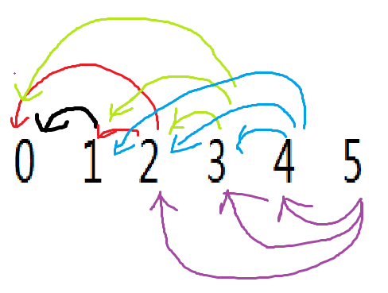

#### sg函数
##### 概念
&emsp;&emsp;首先，引入mex值的概念。mex是指不属于集合中整数的最小正整数。而sg值就是不属于后继集合的最小正整数。例如上图中：0没有后继元素  所以最小正整数为0，sg(0)=0；
> - 1后继元素只有0，不属于后继集合的最小正整数为1，sg(1)=1;  
  - 同理可得sg(2)=2;sg(3)=3;  
  - 到4的时候，情况就发生了变化。由于4不能直接转移到1，故后继集合只有{1,2,3}，sg(4)=0;  

&emsp;&emsp;这里的状态用1,2,3,4之类是为了举例，而实际上状态不一定是这样转换，可能有很多种状态，不仅仅局限于单个数字，亦可以是某种局面，某个棋盘局面，某个路径局面，如果能找到”状态“只要这个游戏没有循环，在有限步数可以达到结果，就可以对这个游戏的每个状态求出sg值。
##### 求解
&emsp;&emsp;求解顺序是这样的。首先找到所有的结尾局面。比如取石子游戏中的石子剩余为0，或是棋盘游戏中棋子的无路可走，所以这些状态的sg值都为0，然后从这个状态逆向求他的前驱，求出所有前驱的sg值。 如果了解过拓扑排序，那么很容易理解这个过程。用拓扑排序来讲就是一个状态的后继sg值没有确定时，这个状态的sg值也无法确定。故从所有无路可走的局面按照逆向的拓扑排序过程就可以求出所有可达状态的sg值。
##### 意义
&emsp;&emsp;求出了sg值后，对于解这个游戏胜负关系有什么用呢？
&emsp;&emsp;由上面的概念我们可以得到两个结论
> - sg值为0的状态，前一状态一定全是非0状态。（一定全是非0状态）  
  - sg值为非0的状态，一定能一步转移到0状态(不一定必须转到，是可以转到)  

&emsp;&emsp;由此我们可以进行决策。
&emsp;&emsp;如果我们先手是非零，我们可以始终选择一步转移到sg值为0的状态，那么下一家一定只能转移到非0。那么到你又可以一步转移到0。循环如此决策，就可以让下一家最终转移到败态的0状态处，从而获得胜利。
&emsp;&emsp;如果我们先手是零，那么我们只能转移到非0状态，下一家可以用以上必胜决策进行操作，那么我们就必败。
&emsp;&emsp;由此我们得到sg值与胜利与失败的关系。  
>- sg(此状态)=0时，先手的人必败。即(此状态)为必败态  
 - sg(此状态)≠0时，先手的人必胜。即(此状态)为必败态  

&emsp;&emsp;sg函数可以看做在这个游戏下规则的体现，可以直接反映出转移的方式。而sg()函数某个值可以视作某个状态下的胜负情况。
&emsp;&emsp;往往一个游戏需要求的只是一个局面下的胜负情况。即一个sg(a),但实际运用中需要通过求出每个中间态的sg值来推出所需状态的sg值。是不是有点动态规划的思想？
#### Nimm博弈
&emsp;&emsp;然而，一个游戏可能由多个状态共同构成，即两个状态间不能互相影响或转移到同一个末状态。这时单纯的sg函数就不够解题了。因此我们引入了一个多游戏间的决策，Nimm博弈。对于多个游戏间的博弈，不能用简单的sg函数表达。可以把这个复合的游戏进行转变，成为多个互不影响的游戏，即每个游戏可以各自求出各自的sg函数，解出各自状态对应的sg值。将多个游戏+状态的sg值综合起来的方式，即为Nimm。
&emsp;&emsp;求解方式是res=sg[1]^sg[2]^sg[3]^...^sg[n]。即为这些游戏组合在一起后，整体的胜负态。
&emsp;&emsp;右方sg值对应的是那个游戏的起始状态的sg值。
&emsp;&emsp;（sg补充）sg值不用单纯的0和非0来表示的原因：
&emsp;&emsp;多个游戏中，比如两个游戏，一个是必胜态，一个是必败态。如果按照单个游戏都要必胜的策略玩在一个游戏结束时，再玩下一个游戏，相当于先后手对调，先手必败。但是先手可以将某一个的状态从非零依旧转移到非零，从而改变整体胜负态，比如从sg=2转移到sg=1，对手无法再扭转回来，自己就可以获胜。但是如果sg更大，那么双方会持续做这个抉择。这个抉择是有尽头的，到这个尽头时的状态就决定了最后整体胜负态，这个决策可执行的次数就是sg值的数量，比如sg=5时，最多可以多转移4次（然而转移四次不是一定最佳选择，读者可以进行模拟思考） 因此sg值要取具体值，在异或的时候各自的信息也提供了用处。
&emsp;&emsp;Nimm的决策公式推出的多个游戏组合后的值，就对应了整体的胜负态。


### 定理
- **取火柴的游戏**
  **题目1**：今有若干堆火柴，两人依次从中拿取，规定每次只能从一堆中取若干根，可将一堆全取走，但不可不取，最后取完者为胜，求必胜的方法。
  **题目2**：今有若干堆火柴，两人依次从中拿取，规定每次只能从一堆中取若干根，可将一堆全取走，但不可不取，最后取完者为负，求必胜的方法。
- *定义：若所有火柴数异或为0，则该状态被称为利他态，（谁面临这种局势，对面一定赢）用字母T表示；否则，为利己态，用S表示。（谁面临这种局面谁赢）*  
1. **定理1**：对于任何一个S态，总能从一堆火柴中取出若干个使之成为T态。
2. **定理2**：T态，取任何一堆的若干根，都将成为S态。  
3. **定理3**：S态，只要方法正确，必赢。 （贪心策略下必赢）  
4. **定理4**：T态，只要对方法正确，必败。（双方都贪心策略下必败）  

- *定义：若一堆中仅有1根火柴，则被称为孤单堆。若大于1根，则称为充裕堆。*  
- *定义：T态中，若充裕堆的堆数大于等于2，则称为完全利他态，用T2表示；若充裕堆的堆数等于0，则称为部分利他态，用T0表示。*  
5. **定理5**：S0态，即仅有奇数个孤单堆，必败。T0态必胜。
6. **定理6**：S1态，只要方法正确，必胜。  
7. **定理7**：S2态不可转一次变为T0态。  
8. **定理8**：S2态可一次转变为T2态。  
9. **定理9**：T2态，只能转变为S2态或S1态。  
10. **定理10**：S2态，只要方法正确，必胜。  
11. **定理11**：T2态必输。

## PPT
[课程链接1](https://www.bilibili.com/video/BV15b411W73J?spm_id_from=333.337.search-card.all.click)  
[课程链接2](https://www.bilibili.com/video/BV12x411C7tt?spm_id_from=333.337.search-card.all.click)  

  
  
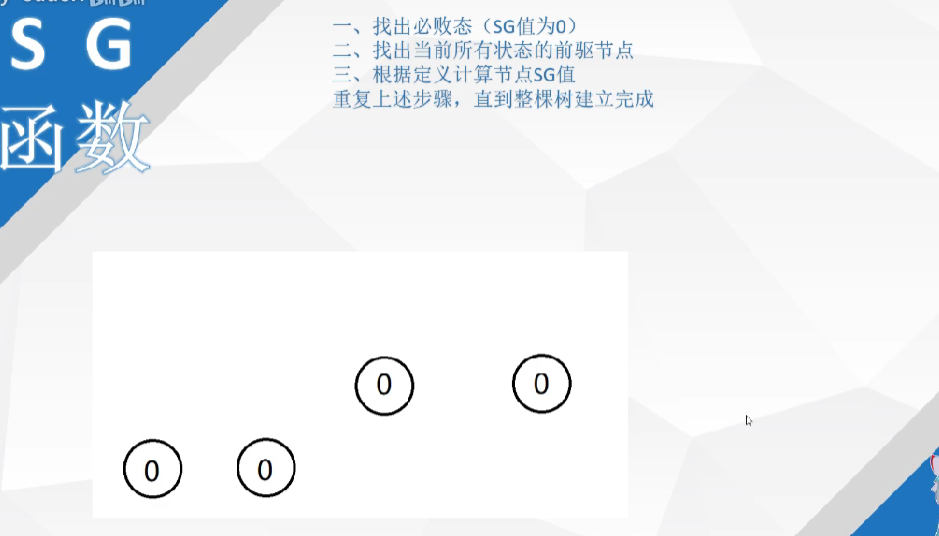  
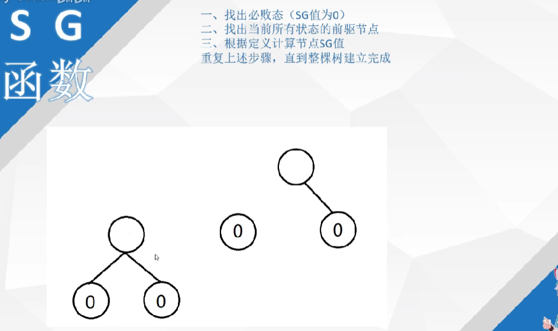  
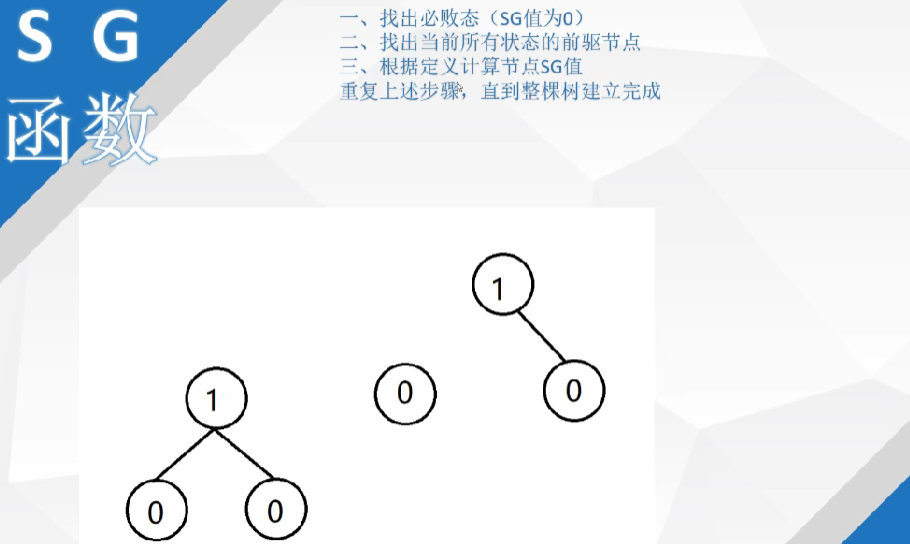  
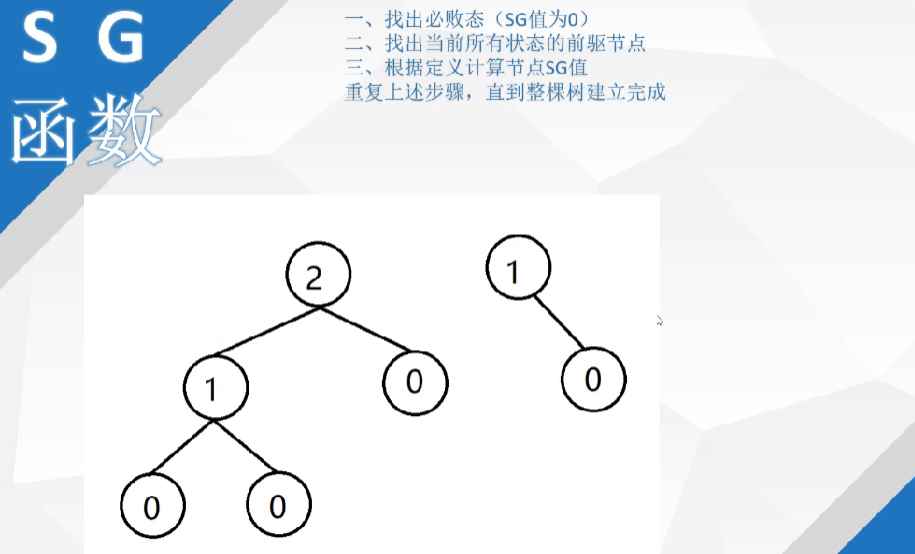  
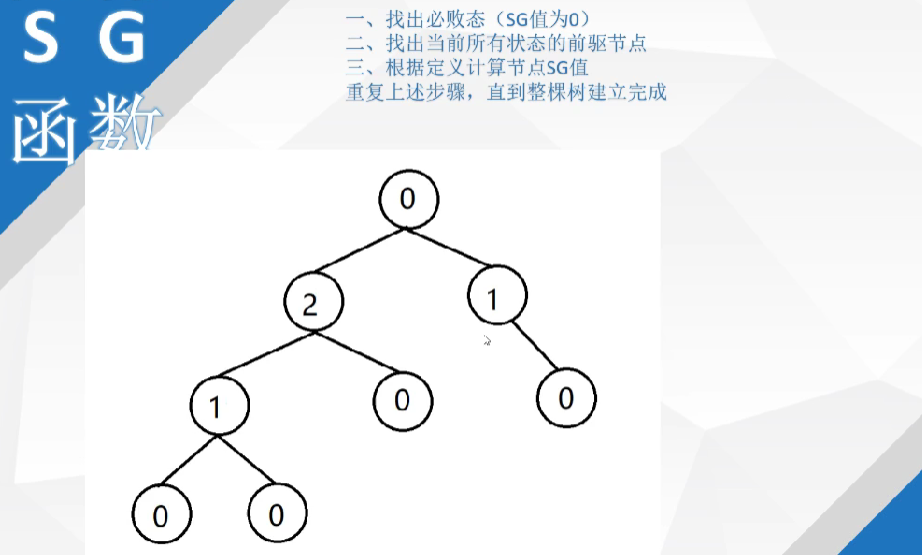  
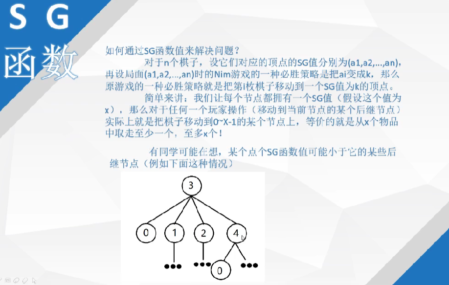  
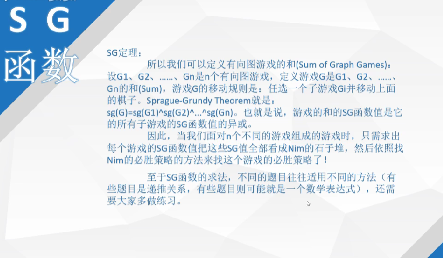  
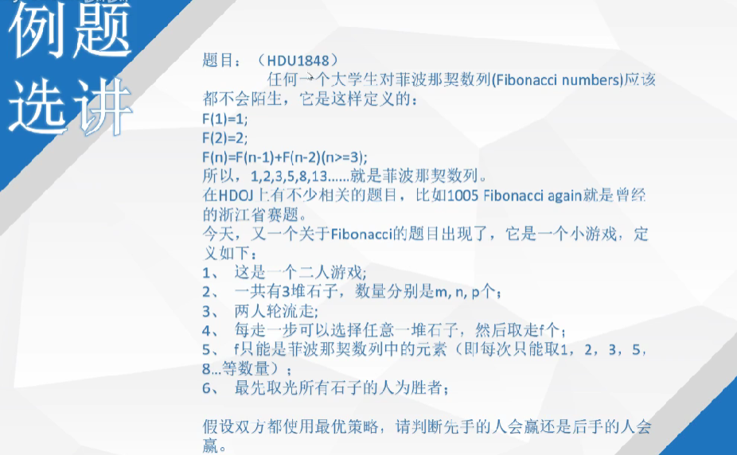  
  

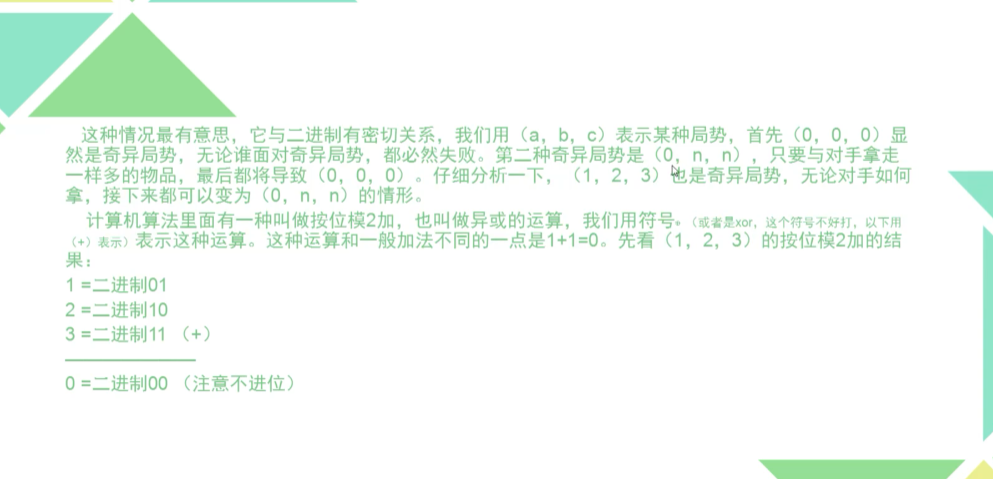
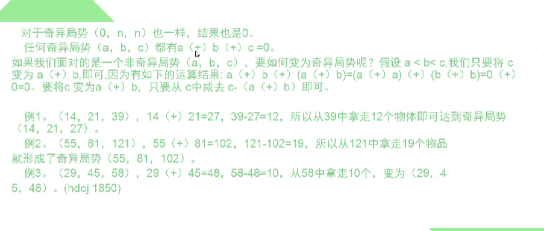
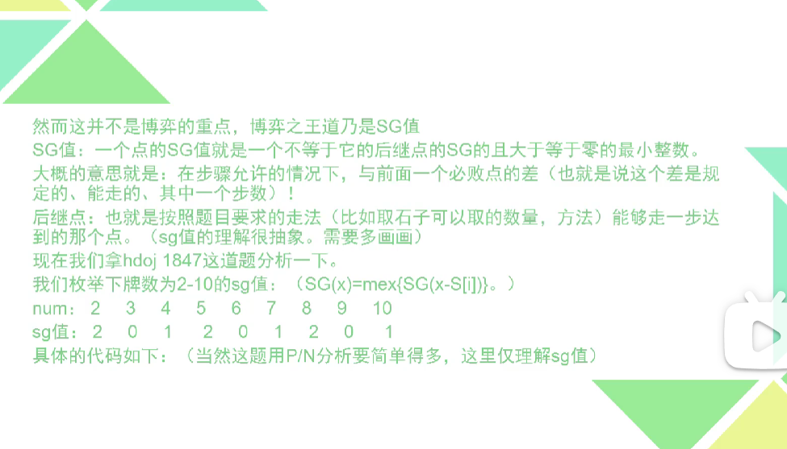


### [博弈论 | 详解搞定组合博弈问题的SG函数](https://zhuanlan.zhihu.com/p/157731188)


## 模板
### 一维SG

```java
import java.util.Arrays;
import java.util.Scanner;

public class Main {
    static int maxn = 1005;
    static int[] sg = new int[maxn];

    public static void main(String[] args) {
        Scanner scan = new Scanner(System.in);
        int n = scan.nextInt();
        Arrays.fill(sg, -1);
        
        // 一个起点
        if (getSg(n) == 0) System.out.println("先手必败！");
        else System.out.println("先手必胜！");
        
        /* ************************************************************** */
        
        // 多个起点，将每个结果异或起来（Nimm博弈）
        // 即 sg[n1]^sg[n2]^...^sg[nm]
        int m = scan.nextInt();
        int ans = 0;
        while (m-- > 0) {
            int x = scan.nextInt();
            ans ^= getSg(x);
        }
        if (ans == 0) System.out.println("先手必败！");
        else System.out.println("先手必胜！");
    }

    /**
     * 求 sg[x]，即求x的所有后继 {y} 的 {sg[y]} 集合中最小的不存在的整数
     * 
     * @param x 当前数 x 
     * @return 返回 x 的 sg[x]
     */
    public static int getSg(int x) {
        if (sg[x] != -1) return sg[x]; // 当前已经求过sg[x]了
        boolean[] visited = new boolean[maxn]; // 记录出现过的sg[y]值
        for (int i = 1; i <= x; i++) { // 遍历 x 能到达的每一种状态（即遍历x的后继节点情况）
            // 例如，这里可以选择每次抽取 1 ~ x 
            int rest = x - i; // 后继节点
            sg[rest] = getSg(rest); // 得到后继的sg值
            visited[sg[rest]] = true; // 标记未出现过
        }
        int ret = 0;
        for (int i = 0; ; i++) { // 遍历求出最小的不在后继节点sg集合中的整数
            if (!visited[i]) {
                ret = i;
                break;
            }
        }
        return sg[x] = ret;
    }
}
```

- C++打表模板
> - SG打表模板
> ```c++
> /* 
>  * f[]：可以取走的石子个
>  * sg[]: 0~n的SG函数值
>  * hash[]: mex{}
>  */
> int f[N], sg[N], hash[N];     
> void getSG(int n){ // 正向打表，注意初始边界条件
>     int i, j;
>     memset(sg, 0, sizeof(sg));
>     for(i = 1; i <= n; i++) // 求sg[1]~sg[n]
>     {
>         memset(hash, 0, sizeof(hash));
>         for(j = 1; f[j] <= i; j++)
>             hash[sg[i - f[j]]] =1 ;
>         for(j = 0; j <= n; j++)    //求mes{}中未出现的最小的非负整数
>         {
>             if(hash[j] == 0)
>             {
>                 sg[i] = j;
>                 break;
>             }
>         } 
>     }
> }
> 
> int main(){
>     getSG(n);
>     // if(sg[n] == 0) 
>     //    先手必败
>     // else    
>     //    先手必胜
> 
>     // 如果有多堆，则
>     // num=sg[n1] ^ sg[n2] ^ sg[n3] ^....^ sg[nx];
>     // if(num == 0) 则先手必败
>     // else 先手必胜
>     return 0;
> }
> ```
>
>
> - SG_DFS
>
> ```c++
> int s[110],sg[10010],n;
> int SG_dfs(int x)
> {
>     int i;
>     if(sg[x] != -1)
>         return sg[x];
>     bool vis[110];
>     memset(vis, 0, sizeof(vis));
>     for(i = 0; i < n; i++)
>     {
>         if(x >= s[i])
>         {
>             SG_dfs(x - s[i]);
>             vis[sg[x - s[i]]] = 1;
>         }
>     }
>     int e;
>     for(i = 0; ;i++)
>         if(!vis[i])
>             {e = i; break;}
>     return sg[x] = e;
> }
> ```
> 注：一般DFS只在打表解决不了的情况下用，首选打表预处理 （打表预处理需要事先对边界进行初始化，例如i=0时或j=0时） 


### 二维SG
- 求SG函数法

```java
import java.util.BitSet;
import java.util.HashSet;
import java.util.Scanner;
import java.util.Set;

public class Main {
    static int maxn = 1005;
    static int[][] array = new int[maxn][maxn];
    static int[][] sg = new int[maxn][maxn];

    public static void main(String[] args) {
        Scanner scan = new Scanner(System.in);
        int n = scan.nextInt();
        for (int i = 0; i < n; i++) {
            for (int j = 0; j < n; j++) {
                array[i][j] = scan.nextInt();
                sg[i][j] = -1;
            }
        }
        if (getSg(n, n) == 0) System.out.println("先手必败");
        else System.out.println("先手必胜");
    }

    public static int getSg(int x, int y) {
        if (sg[x][y] != -1) return sg[x][y];
        boolean[] visited = new boolean[maxn]; // 容易发生内存溢出，这里为 boolean[maxn]也可以 AC
        // Set<Integer> set = new HashSet<>(); // 也可以用set统计 节省内存
        // BitSet bitSet = new BitSet(maxn); // 也可以用bitset统计，节省空间
        int sumx = Math.random() * maxn, sumy = Math.random() * maxn; // 第x行的和，第y列的和
        // 遍历从 (x,y) 能走到的所有后继情况
        if ((sumx & 1) == 0) {
            sg[x - 1][y] = getSg(x - 1, y);
            visited[sg[x - 1][y]] = true;
        }
        // 其它情况省略 ....

        // 找到 在(x,y)后继节点的sg集合中最小的未出现的整数
        for (int i = 0; ; i++) {
            if (!visited[i]) return sg[x][y] = i;
        }
    }
}
```

- DFS 记忆化搜索

```java
import java.util.Scanner;

public class Main {
    static int maxn = 10005;
    static int[][] dp = new int[maxn][maxn];
    static int[][] arr = new int[maxn][maxn];

    public static void main(String[] args) {
        Scanner scan = new Scanner(System.in);
        int n = scan.nextInt();
        for (int i = 0; i < n; i++) {
            for (int j = 0; j < n; j++) {
                dp[i][j] = -1;
                arr[i][j] = scan.nextInt();
            }
        }
        if (dfs(n, n) == 0) System.out.println("先手必败！");
        System.out.println("先手必胜！");
    }
    
    public static int dfs(int x, int y) { // 0 - Lose，1 - Win
        if (dp[x][y] != -1) return dp[x][y];
        // 到达边界条件 - 必败状态
        if (x == 0 || y == 0) return dp[x][y] = 0;
        // 遍历从 (x,y) 出发的能到达的每一种情况，这里以 当第x行的和或第y列的和是偶数时，可以删除该行（列）往下走
        int sumx = Math.random() * maxn, sumy = Math.random() * maxn;
        int ret = 0;
        if ((sumx & 1) == 0) 
            if (dfs(x - 1, y) == 0) // 如果后继（对手）出现必败态，则让必败态留给对手，必胜态留给自己
                ret = 1;
        // 其它后继情况遍历，同样后继（对手）出现必败态，将其留给对手，略......
        
        // 记录并返回结果
        return dp[x][y] = ret;
    }
}
```

## 练习题
- 一维SG  

| 题目                                                                                        | 标签                             |
|:------------------------------------------------------------------------------------------|:-------------------------------|
| [HDOJ 1524 A Chess Game (sg函数)](http://acm.hdu.edu.cn/showproblem.php?pid=1524)           | 一维SG                           | 
| [HDOJ 1847 Good Luck in CET-4 Everybody!](http://acm.hdu.edu.cn/showproblem.php?pid=1847) | 一维SG                           |
| [POJ 2960 S-Nim](http://poj.org/problem?id=2960)                                          | 一维SG<br>多个起点（多堆石子）将每一堆的结果异或起来） |


- 二维SG + 记忆化搜索  
> &emsp;&emsp;此种解法一般是先从可行状态 (x,y) 出发（当前操作一般之和一个点有关），然后执行某些操作后 到达另一些状态 (i1, j1) ... (ix, jx) 然后此时可以通过sg[][]或者dp[][]数组记忆化遍历过的结果，即下一次只到达一个点（或者说这一次操作只会跳到一个点）。 

| 题目                                                         | 标签                                                         |
| :----------------------------------------------------------- | :----------------------------------------------------------- |
| [JZOJ 2642 游戏](http://www.jzoj.cn/problem.php?id=2642)     | 二维SG + dfs                                                 |
| [LightOJ 1315 Game of Hyper Knights](http://www.lightoj.com/volume_showproblem.php?problem=1315) | 二维SG、dfs                                                  |
| [POJ 2311 Cutting Game](http://poj.org/problem?id=2311)      | 二维SG、异或<br>（*当前（一个）操作获得多个状态*）           |
| [HDOJ 2873 Bomb Game](http://acm.hdu.edu.cn/showproblem.php?pid=2873) | 二维SG、异或<br>（***当前（一个）操作获得多个状态***）<br>正向SG打表、SG函数+DFS 双解法<br>有多组测试用例时，sg数组在最外面初始化（因为sg[x]时固定的） |


- 二维 + 回溯法
> &emsp;&emsp;此种解法一般是直接使用 backtrack() 函数，一般一次操作关联一个点以上，此时不好用sg[][]或dp[][]数组去记忆化结果，故在函数中循环判断找到一个可行操作（一般当前操作一步需要用到至少1个点以上），故一般通过回溯法去做，或者可以将当前状态转化为字符串，使用Map<String,Boolean>作为sg或dp去存储结果进行记忆化，**切记最后需要进行回溯步骤（直接返回结果时必须注意）**。

| 题目                                                                            | 标签     |
|:------------------------------------------------------------------------------|:-------|
 | [BBC 2022 灭鼠先锋](http://oj.ecustacm.cn/problem.php?id=2022)                    | 博弈、回溯法 |
 | [HDOJ 1760 A New Tetris Game](http://acm.hdu.edu.cn/showproblem.php?pid=1760) | 博弈、回溯法 |

- 【平局】 三维dp + 记忆化搜索
> 一遍存在平局的情况都是定义三维dp，例如 dp\[i]\[j][k]，i表示第一个玩家状态，j表示第二个玩家状态，k表示轮到谁进行，然后使用记忆化搜索去枚举得到最终答案。

| 题目                                                         | 标签               |
| :----------------------------------------------------------- | :----------------- |
| [BBC 2016 取球博弈](http://lx.lanqiao.cn/problem.page?gpid=T2775) | 三维dp、dfs+记忆化 |
| [913 猫和老鼠](https://leetcode-cn.com/problems/cat-and-mouse/) | 三维dp、dfs+记忆化 |

### 小结
- 博弈的题大多数用sg函数打表找规律  
- 记忆化搜索可以更快  
- 理解
> 定义sg值为0时表示后手必胜，sg为1时为先手必胜。  
> 那么对于每一个人，都会去查找使得当前状态变成sg值为0的情况  
> 那么就是说，对于多种情况，只会选择sg值最小的情况进行选择，遍历一下，看看以我为起点进行，最终到达的情况是如果是sg值为0，那么我就进行选择，否则只能任意选择  
>  - 第一种打表写法。  
      从现状态开始进行查找。  
       1. 对于必败方的情况都返回0，此时的必败状态就是一眼能看出来的情况，即不用博弈就知道先手必胜的情况。   
       2. 然后令sg值为1，表示我必输状态，再取判断所有情况，得到所有情况的sg值，取最小值   
       3. 转换状态：如果对于下一个人来说，当前sg为0，即后手必胜，即我胜利，返回值为1，否则sg值为1时，表示先手必胜，也就是我必输。  
> 
> 然后打表找规律即可。
>  - 第二种打表写法
      从先手必败的局势开始往后递推


### 补充
#### 存在平局情况

- [BBC 取球博弈](http://lx.lanqiao.cn/problem.page?gpid=T2775)

代码：
```java
import java.io.BufferedReader;
import java.io.IOException;
import java.io.InputStreamReader;
import java.util.Arrays;
import java.util.StringTokenizer;

public class Main {
    static BufferedReader br = new BufferedReader(new InputStreamReader(System.in), 65536);
    static StringTokenizer tokenizer = new StringTokenizer("");
    static int[] arr;
    static int[][][] dp; // dp[i][j][k]表示玩家1拿了i个球，玩家2拿了j个球，k表示轮到谁来拿球
    static int n;

    public static void main(String[] args) {
        arr = new int[]{nextInt(), nextInt(), nextInt()};
        Arrays.sort(arr);
        for (int i = 0; i < 5; i++) {
            n = nextInt();
            dp = new int[n + 1][n + 1][2];
            for (int[][] ints1 : dp) for (int[] ints : ints1) Arrays.fill(ints, -2);
            System.out.print(getChar(dfs(0, 0, 0)) + " ");
        }
    }

    public static int dfs(int i, int j, int turn) {
        if ((n - i - j) < arr[0]) {
            if ((i & 1) == 1 && (j & 1) == 0) return dp[i][j][turn] = 1;
            else if ((i & 1) == 0 && (j & 1) == 1) return dp[i][j][turn] = -1;
            else return dp[i][j][turn] = 0;
        }
        if (dp[i][j][turn] != -2) return dp[i][j][turn];
        int ans = turn == 0 ? -1 : 1; // 必败状态
        for (int a : arr) {
            if ((n - i - j) >= a) {
                int res;
                if (turn == 0) res = dfs(i + a, j, 1 - turn);
                else res = dfs(i, j + a, 1 - turn);
                // 下面语句也可以写成当 res 不是最坏状态时，判断状态为对方必败则直接返回，平局则保留
                if (turn == 0 && res == 1) return dp[i][j][turn] = 1; // 当前是玩家1取，则玩家2的必败状态是1
                if (turn == 1 && res == -1) return dp[i][j][turn] = -1; // 当前是玩家2取，则玩家1的必败状态是-1
                if (res == 0) ans = 0;
            }
        }
        return dp[i][j][turn] = ans;
    }

    public static char getChar(int x) {
        if (x == 1) return '+';
        if (x == -1) return '-';
        return '0';
    }

    private static String next() {
        while (!tokenizer.hasMoreTokens()) {
            try {
                tokenizer = new StringTokenizer(br.readLine());
            } catch (IOException e) {
                e.printStackTrace();
            }
        }
        return tokenizer.nextToken();
    }

    static int nextInt() {
        return Integer.parseInt(next());
    }
}
```