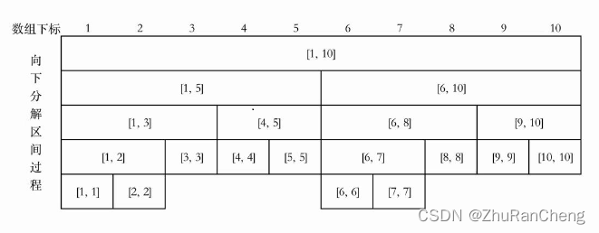
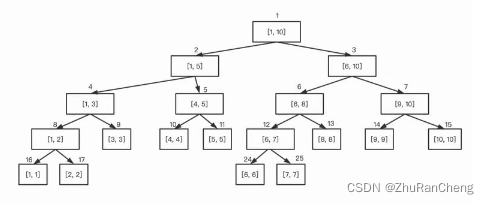
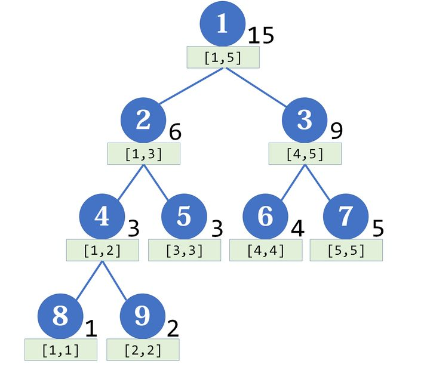
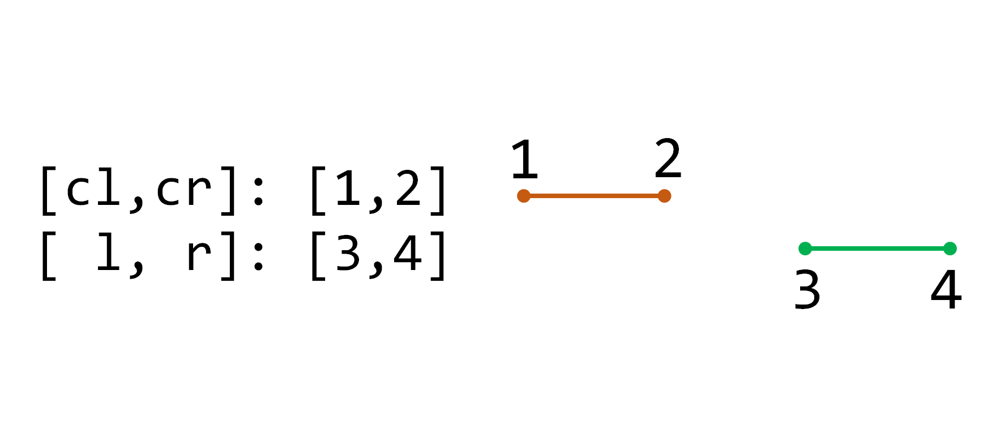
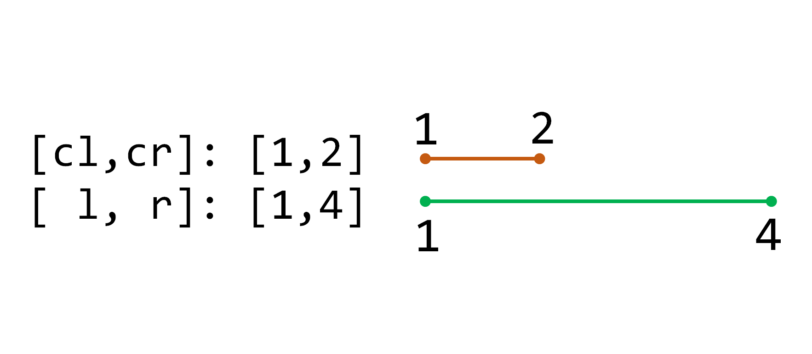
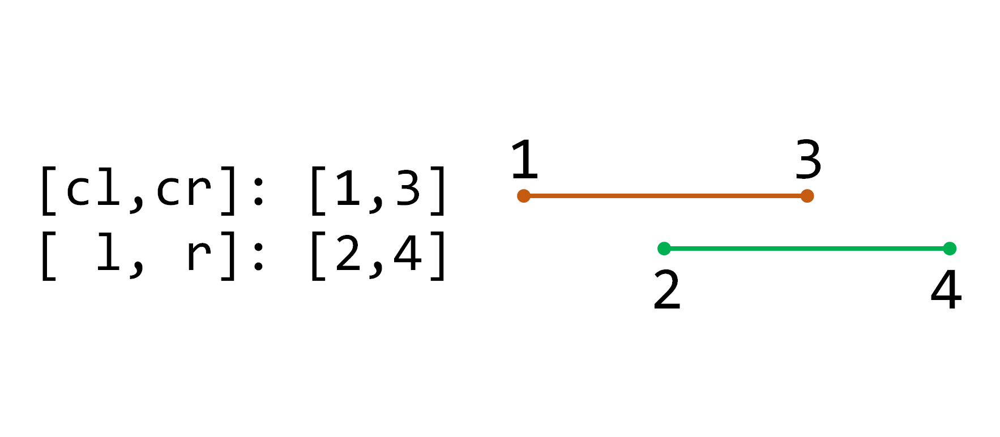
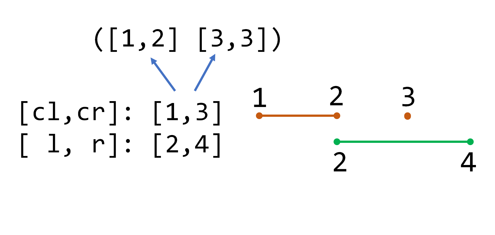
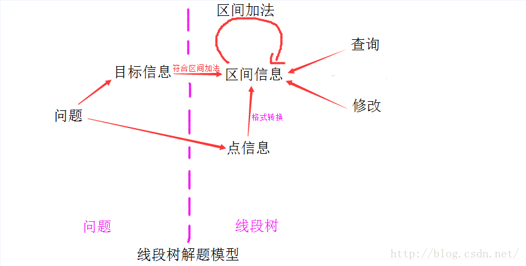

## 线段树

### 概念

​        线段树（Segment Tree）几乎是算法竞赛最常用的数据结构，它主要用于维护区间信息（要求满足结合律）。与树状数组相比，它可以实现 $O(log_n)$ 的区间修改，还可以同时支持多种操作（加、乘），更具通用性。一个包含 $n$ 个区间的线段树，空间复杂度为 $O(n)$，查询的时间复杂度则为 $O(log_n+k)$，其中 $k$ 是符合条件的区间数量。

​        线段树是一种二叉搜索树，常用于统计区间上的信息；

​        其每个节点存储的是一个区间的信息，每个节点包含三个元素：

> 1. 区间左端点；
> 2. 区间右端点；
> 3. 区间内维护的信息；

- 思想
  线段树的思想就是将数组内所有元素看作是一个区间，将每个区间递归的进行分解，直到区间内只剩下一个元素为止；
  
- 原理
  线段树存在五个操作

> 1. pushup：由子节点计算父节点的信息；
> 2. pushdown：把当前父节点的修改信息下传到子节点，也被称为懒标记（延迟标记）；这个操作比较复杂，一般不涉及到区间修改则不用写。
> 3. build：将一段区间初始化成线段树；
> 4. modify：修改操作，分为两类：① 单点修改（需要使用pushup），② 区间修改（需要使用pushdown）；
> 5. query：查询一段区间的值。


​        线段树的原理：线段树除了最后一层之外，是一棵满二叉树，假设区间中存在 $n$ 个数据，则倒数第二层节点数大约为 $n$，从第一层到倒数第三层的节点数大约为 $n-1$ ，最后一层节点数很少，但是为了使用数组存储整棵树，最后一层大约需要开 $2n$ 的空间，因此一共需要开辟 $4n$ 的空间存储线段树。

- 性质

> 1. 线段树的每个节点都代表一个区间；
> 2. 线段树具有唯一的根节点，代表整个 $[1, n]$ 区间的统计范围；
> 3. 线段树的每一个叶节点都代表一个长度为 $1$ 的区间 $[x, x]$ ；
> 4. 对于每个内部节点 $[l, r]$ 它的左节点是 $[l, mid]$ ，右节点是 $[mid + 1, r]$ ，其中 $mid = ⌊ ( l + r ) /2 ⌋$ ；
> 5. 若线段树去掉最后一层，一定是一个满二叉树；

​        按照二叉树的标号方法对线段树进行编号，如图所示：



​        根节点编号为 $1$ ，编号为 $x$ 的节点的左节点为 $x * 2$ ，右节点为$x * 2 + 1$ ；可以使用二叉树的顺序结构来存储来存储线段树，即将节点编号当作下表存储到数组中；但可以发现树的最后一层节点在数组中存储的位置不是连续的，直接空出数组中保存的位置即可。理想情况下， $n$ 个节点的满二叉树有 $2 * n - 1$ 个节点。最后还有一层产生了空余，所以要保证数组长度要不小于 $4 * n$ 才不会越界。

- 作用
  线段树将区间递归分为多个小区间，可以用来解决区间问题；
  其最基本的作用有：

> 1. 维护区间信息；
> 2. 合并区间信息；
> 3. 对序列进行维护，支持查询与修改操作；

### 实现

#### 递归实现

##### 创建

​        线段树是一棵平衡二叉树。母结点代表整个区间的和，越往下区间越小。注意，线段树的每个节点都对应一条线段（区间），但并不保证所有的线段（区间）都是线段树的节点，这两者应当区分开。


​        如果有一个数组 $[1,2,3,4,5]$ ，那么它对应的线段树大概长这个样子：



​        每个节点 $p$ 的左右子节点的编号分别为$2*p$ 和 $2*p+1$ ，假如**节点 $p$ 储存区间 $[a,b]$ 的和**，设 $mid=\lfloor {(a+b) \over {2}}\rfloor$ ，那么两个子节点分别储存 $[l,mid]$ 和 $[mid+1,r]$ 的和。可以发现，左节点对应的区间长度，与右节点相同或者比之恰好多 $1$。

​        如何从数组建立一棵线段树？我们可以考虑递归地进行。
代码：

```java
/**
 * 创建以节点 p 为根的线段树
 *
 * @param l 左边界
 * @param r 右边界
 * @param p 当前节点        
 */
public void build(int l, int r, int p) {
    if (l == r) // 到达叶子节点
        tree[p] = A[l]; // 用数组中的数据赋值
    else {
        int mid = (l + r) >> 1;
        build(l, mid, p * 2); // 建立左孩子节点
        build(mid + 1, r, p * 2 + 1); // 建立右孩子节点
        tree[p] = tree[p * 2] + tree[p * 2 + 1]; // 该节点的值等于左右孩子之和
    }  
}

// PushUp函数更新节点信息 ，这里是求和
public void pushup(int p) {
    tree[p] = tree[p * 2] + tree[p * 2 + 1];  
}
```


##### 区间修改

​        例如：$A[l,r] += d$.


​        在讲区间修改前，要先引入一个“懒标记”（或延迟标记）的概念。懒标记是线段树的精髓所在。对于区间修改，朴素的想法是用递归的方式一层层修改（类似于线段树的建立），但这样的时间复杂度比较高。使用懒标记后，对于那些正好是线段树节点的区间，我们不继续递归下去，而是打上一个标记，将来要用到它的子区间的时候，再向下传递。

​        更新时，我们是从最大的区间开始，递归向下处理。注意到，任何区间都是线段树上某些节点的并集。于是我们记目标区间为 $[l, r]$ ，当前区间为 $[cl, cr]$ ， 当前节点为 $p$ ，我们会遇到三种情况：


1. 当前区间与目标区间没有交集：

<div style="text-align: center"></div>
这时直接结束递归。

2. 当前区间被包括在目标区间里：

<div style="text-align: center"></div>
这时可以更新当前区间，别忘了乘上区间长度：$tree[p] += (cr - cl + 1) * d$; 然后打上懒标记（叶子节点可以不打标记，因为不会再向下传递了）： $mark[p] += d$; 这个标记表示“该区间上每一个点都要加上 $d$”。因为原来可能存在标记，所以是 $+=$ 而不是 $=$。

3. 当前区间与目标区间相交，但不包含于其中：

<div style="text-align: center"></div>
这时把当前区间一分为二，分别进行处理。如果存在懒标记，要先把懒标记传递给子节点（注意也是+=，因为原来可能存在懒标记）：
```
ll mid = (cl + cr) / 2;
mark[p * 2] += mark[p];
mark[p * 2 + 1] += mark[p];
```
两个子节点的值也就需要相应的更新（后面乘的是区间长度）：
```
tree[p * 2] += mark[p] * (mid - cl + 1);
tree[p * 2 + 1] += mark[p] * (cr - mid);
```
不要忘记清除该节点的懒标记：
```
mark[p] = 0;
```
这个过程并不是递归的，我们只往下传递一层（所以叫“懒”标记啊！），以后要用再才继续传递。其实我们常常把这个传递过程封装成一个函数：
```c++
inline void push_down(ll p, ll len)
{
    // 下推标记
    mark[p * 2] += mark[p];
    mark[p * 2 + 1] += mark[p];
    // 修改子节点的sum使之与对应的mark相对应
    tree[p * 2] += mark[p] * (len - len / 2);
    tree[p * 2 + 1] += mark[p] * (len / 2); // 右边的区间可能要短一点
    mark[p] = 0; // 更新完毕，清除本节点的标记
}
```
然后在update函数中这样调用：
```
push_down(p, cr - cl + 1);
```
传递完标记后，再递归地去处理左右两个子节点。
<div style="text-align: center"></div>

代码：

```java
/**
 * @param [l, r] 目标区间
 * @param [cl, cr] 当前区间 [1,n] 
 * @param p 当前节点 1          
 */
void update(int l, int r, int d, int p, int cl, int cr) {
    // if (l > cr || r < cl) return; // 剪枝，本区间和当前节点区间无交集
    if (cl >= l && cr <= r) { // 本（目标）区间完全在当前区间 [cl,cr] 内
        tree[p] += (cr - cl + 1) * d; // 更新当前区间的和，向上保持正确
        // 如果不是叶子节点，给当前区间打上标记
        // 表示本区间的Sum正确，子区间的Sum仍需要根据Add的值来调整
        if (cr > cl) mark[p] += d; 
    } else { // 目标区间与当前区间有交集，但不包含于其中
        int mid = (cl + cr) / 2;
        // 标记向下传递
        mark[p * 2] += mark[p];
        mark[p * 2 + 1] += mark[p];
        // 往下更新一层
        tree[p * 2] += mark[p] * (mid - cl + 1);
        tree[p * 2 + 1] += mark[p] * (cr - mid);
        // 清除标记
        mark[p] = 0; 
        // 递归往下寻找
        // 先判断左右子树和当前操作区间[cl,cr]是否有交集，有交集才递归
        if (l <= mid) update(l, r, d, p * 2, cl, mid);
        if (r > mid) update(l, r, d, p * 2 + 1, mid + 1, cr);
        // 根据子节点更新当前节点的值
        tree[p] = tree[p * 2] + tree[p * 2 + 1];
    }
}
```

[区间 [1-4] 加上1的过程](https://vdn1.vzuu.com/SD/534181e0-23ad-11eb-905e-ca0d7949bec0.mp4?disable_local_cache=1&bu=078babd7&c=avc.0.0&f=mp4&expiration=1654146685&auth_key=1654146685-0-0-8d8d09bf3f151ffeb9a8877b35e8d5e2&v=hw&pu=078babd7)

##### 点修改
​        至于单点修改，只需要令左右端点相等即可。

代码：
```java
/**
 * @param l 要修改的点索引
 * @param d 增加的值
 * @param p 当前节点
 * @param [cl, lr] 当前操作区间          
 */
void update(int l, int d, int p, int cl, int cr) {
    if (cl == cr) // 达到叶子节点
        tree[p] += d;
    else {
        int mid = cl + cr >> 1;
        // 根据条件判断往左子树还是右子树进行调用
        if (l <= mid) update(l, d, p << 1, cl, mid);
        else update(l, d, p << 1 | 1, mid + 1, cr);
        pushup(p); // 子节点更新完后，更新父节点的信息
    }
}
```

##### 区间查询
​        有了区间修改的经验，区间查询的方法完全类似

代码：
```java
/**
 * @param [l, r] 目标区间
 * @param p 当前节点
 * @param [cl, cr] 当前操作节点区间         
 */
int query(int l, int r, int p, int cl, int cr) {
    // if (l > cr || r < cl) return 0; // （剪枝操作，一般放在前面和减少边界情况下的操作步骤）区间无交集，直接返回0
    if (l <= cl && cr <= r) return tree[p]; // 当前区间在目标区间内，直接返回
    int mid = cl + cr >> 1;
    push_down(p, cl - cr + 1); // 只涉及单点修改不用 进行该操作
    // 累计答案
    int ans = 0;
    if (l <= mid) ans += query(l, r, p << 1, cl, mid);
    if (r > mid) ans += query(l, r, p << 1 | 1, mid + 1, cr);
    return ans;
       
}
```

##### 函数调用（注意）

```java
// 建树
build(1, n, 1);
// 点修改
update(l, d, 1, 1, n);
// 区间修改
update(l, r, d, 1, 1, n);
// 区间查询
int ans = query(l, r, 1, 1, n);
```

##### 模板一（固定数组）★

```java
import java.util.Scanner;

public class Main {
    static int maxn = (int) 1e5 + 5;
    static int[] tree = new int[maxn << 2], mark = new int[maxn << 2];
    static int[] array = new int[maxn];
    static int n, m;

    public static void main(String[] args) {
      Scanner scan = new Scanner(System.in);
      int n = scan.nextInt(), m = scan.nextInt();
      for (int i = 1; i <= n; i++) array[i] = scan.nextInt();
      build(1, 1, n);
      while (m-- > 0) {
        int o = scan.nextInt() ,l = scan.nextInt(), r = scan.nextInt();
        if (o == 1) {
          int d = scan.nextInt();
          update(l, r, d, 1, 1, n);
        }
        else System.out.println(query(l, r, 1, 1, n));
      }
    }

    static void push_up(int p) {
      tree[p] = tree[p << 1] + tree[p << 1 | 1];
    }

    static void push_down(int p, int len) { // 不涉及到区间修改不需要此方法
      if (len <= 1) return;
      tree[p << 1] += mark[p] * (len - len / 2);
      mark[p << 1] += mark[p];
      tree[p << 1 | 1] += mark[p] * (len / 2); // 右子树长度一般更小
      mark[p << 1 | 1] += mark[p];
      mark[p] = 0;
    }

    static void build(int p, int l, int r) {
      if (l == r) {
        tree[p] = array[l];
      } else {
        int mid = l + r >> 1;
        build(p << 1, l, mid);
        build(p << 1 | 1, mid + 1, r);
        tree[p] = tree[p << 1] + tree[p << 1 | 1]; // push_up(p);
      }
    }

    static void update(int l, int d, int p, int cl, int cr) {
      if (cl == cr) {
        tree[p] += d;
      } else {
        int mid = cl + cr >> 1;
        if (l <= mid) update(l, d, p << 1, cl, mid);
        else update(l, d, p << 1 | 1, mid + 1, cr);
        push_up(p);
      }
    }

    static void update(int l, int r, int d, int p, int cl, int cr) {
      if (l <= cl && cr <= r) {
        tree[p] += (cr - cl + 1) * d;
        mark[p] += d;
      } else {
        push_down(p, cr - cl + 1);
        int mid = cl + cr >> 1;
        if (l <= mid) update(l, r, d, p << 1, cl, mid);
        if (r > mid) update(l, r, d, p << 1 | 1, mid + 1, cr);
        push_up(p);
      }
    }

    static int query(int l, int r, int p, int cl, int cr) {
      if (l <= cl && cr <= r) return tree[p];
      push_down(p, cr - cl + 1);
      int mid = cl + cr >> 1, ans = 0;
      if (l <= mid) ans += query(l, r, p << 1, cl, mid);
      if (r > mid) ans += query(l, r, p << 1 | 1, mid + 1, cr);
      return ans;
    }
}
```

##### 模板二（固定数组）★
```java
public class Main {
    static int maxn = (int) 1e5 + 5;

    static class Node {
        int l, r;
        long v, f;

        public Node() {}

        public Node(int l, int r) {
            this.l = l;
            this.r = r;
        }
    }

    static Node[] tree = new Node[maxn << 2];
    static long[] array = new long[maxn];
    static {
        for (int i = 0; i < maxn << 2; i++) tree[i] = new Node();
    }

    public static void main(String[] args) {
        Scanner scan = new Scanner(System.in);
        int n = scan.nextInt(), m = scan.nextInt();
        for (int i = 1; i <= n; i++) {
            array[i] = scan.nextLong();
        }
        build(1, 1, n);
        while (m-- > 0) {
            int o = scan.nextInt(), x = scan.nextInt(), y = scan.nextInt();
            if (o == 1) {
                long k = scan.nextLong();
                update(x, y, k, 1);
            } else {
                System.out.println(query(x, y, 1));
            }
        }
    }

    /**
     * 更新节点信息，这里是求和操作
     *
     * @param p 当前操作节点
     */
    static void push_up(int p) {
        tree[p].v = tree[p << 1].v + tree[p << 1 | 1].v;
    }

    /**
     * 递归创建线段树
     *
     * @param p 当前操作的节点
     * @param l 左边界
     * @param r 右边界
     */
    static void build(int p, int l, int r) {
        tree[p] = new Node(l, r);
        if (l == r) tree[p].v = array[l];
        else {
            int mid = l + r >> 1;
            build(p << 1, l, mid);
            build(p << 1 | 1, mid + 1, r);
            push_up(p);
        }
    }

    /**
     * 标记向下传递
     *
     * @param p 当前操作的节点
     */
    static void push_down(int p) { // 向下传递
        tree[p << 1].v += tree[p].f * (tree[p << 1].r - tree[p << 1].l + 1); // 更新左孩子的值
        tree[p << 1].f += tree[p].f; // 将标记向左孩子传递
        tree[p << 1 | 1].v += tree[p].f * (tree[p << 1 | 1].r - tree[p << 1 | 1].l + 1);
        tree[p << 1 | 1].f += tree[p].f;
        tree[p].f = 0; // 清楚当前节点的标记
    }

    /**
     * 单点修改
     * 即更改某一个点的状态。
     * 结合单点查询的原理，找到x的位置；根据建树状态合并的原理，修改每个结点的状态。
     *
     * @param l 修改点的坐标
     * @param d 增加的值
     * @param p 当前操作节点
     */
    static void update(int l, long d, int p) {
        if (tree[p].l == tree[p].r) {
            tree[p].v += d;
            return;
        }
        int mid = tree[p].l + tree[p].r >> 1;
        if (l <= mid) update(l, d, p >> 1);
        else update(l, d, p >> 1 | 1);
        push_up(p); // 所有包含结点p的结点状态更新
    }

    /**
     * 区间修改
     * <p>
     * 我们不要递归到每个节点。所以要有一个新的概念：懒标记。
     * 所以，传下来的更改值若在一个区间里，就不再下传，修改完该节点信息后，在此节的懒标记上打一个更改值。
     * 当需要递归这个节点的子节点时，标记下传给子节点。这里不必管用哪个子节点，两个都传下去。
     * <p>
     * ①当前节点的懒标记累积到子节点的懒标记中。
     * <p>
     * ②修改子节点状态。在引例中，就是原状态+子节点区间点的个数父节点传下来的懒标记。
     * <p>
     * ③父节点懒标记清0。这个懒标记已经传下去了，欠债还清，不用再还了。
     *
     * @param l 修改区间的左边界
     * @param r 修改区间的右边界
     * @param d 增加的值
     * @param p 当前操作节点
     */
    static void update(int l, int r, long d, int p) {
        if (l <= tree[p].l && tree[p].r <= r) {
            tree[p].v += (tree[p].r - tree[p].l + 1) * d;
            tree[p].f += d;
            return;
        }
        if (tree[p].f != 0) push_down(p);
        int mid = tree[p].l + tree[p].r >> 1;
        if (l <= mid) update(l, r, d, p << 1);
        if (r > mid) update(l, r, d, p << 1 | 1);
        push_up(p);
    }

    /**
     * 单点查询
     *
     * @param l 查询点索引
     * @param p 当前操作的点
     * @return 返回查询的点的值
     */
    static long query(int l, int p) {
        if (tree[p].l == tree[p].v) return tree[p].v;
        if (tree[p].f != 0) push_down(p);
        int mid = tree[p].l + tree[p].r >> 1;
        if (l <= mid) return query(l, p >> 1);
        else return query(l, p >> 1 | 1);
    }

    /**
     * 区间查询
     *
     * @param l 查询区间的左边界
     * @param r 查询区间的右边界
     * @param p 当前操作的点
     * @return 返回查询区间的和
     */
    static long query(int l, int r, int p) {
        if (l <= tree[p].l && tree[p].r <= r) return tree[p].v;
        if (tree[p].f != 0) push_down(p);
        int mid = tree[p].l + tree[p].r >> 1, ans = 0;
        if (l <= mid) ans += query(l, r, p << 1);
        if (r > mid) ans += query(l, r, p << 1 | 1);
        return ans;
    }
}
```

#### 非递归实现
​        非递归的实现，代码简单（尤其是点修改和区间查询），速度快，建树简单，遍历元素简单。不过，要支持区间修改的话，代码会变得复杂，所以区间修改的时候还是要取舍。有个特例，如果区间修改，但是只需要在所有操作结束之后，一次性下推所有标记，然后求结果，这样的话，非递归写起来也是很方便的。

##### 定义
```java
int maxn = (int) 1e5 + 5;
int A[max], n, N; // 原数组，n为原数组个数，N为扩充元素个数
int tree[maxn << 2]; // 区间和
int mark[maxn << 2]; // 懒惰标记
```

##### 创建
代码：
```java
void build(int n) {
    // 计算 N 的值
    N = 1;
    while (N < n + 2) N <<= 1;
    // 更新叶节点
    for (int i = 1; i <= n; i++) tree[N + i] = A[i]; // 原数组下标+N=存储下标
    // 更新非叶子节点
    for (int i = N - 1; i > 0; --i) {
        // 更新所有非叶子节点的统计信息
        tree[i] = tree[i << 1] + tree[i << 1 | 1];
        // 清空所有非叶子节点的 add 标记
        mark[i] = 0;
    }
}
```

##### 点修改
- $A[l] += d$

代码：
```java
void update(int l, int d) {
    for (int p = N + L; p > 0; p >>= 1) {
        tree[s] += d;
    }    
}
```

##### 点修改下的区间查询
- 求 $A[L..R]$ 的和（点修改没有使用Add所以不需要考虑）  
- 代码非常简洁，也不难理解,  
- s 和 t 分别代表之前的论述中的左右蓝色节点，其余的代码根据之前的论述应该很容易看懂了。  
- s\^t\^1 在 s 和 t 的父亲相同时值为 0 ，终止循环。  
- 两个if是判断s和t分别是左子节点还是右子节点，根据需要来计算Sum  

代码：
```java
int query(int l, int r) {
    int ans = 0;
    for (int p = N + l - 1, t = N + r + 1; p ^ t ^ 1; p >>= 1, t >>= 1) {
        if (~p & 1) ans += tree[p ^ 1];
        if (t & 1) ans += tree[t ^ 1];
    }
    return ans;
}
```

##### 区间修改
- $A[L,R] += D$ 

代码：
```java
void update(int l, int r, int d) {
    int s, t, ln = 0, rn = 0, x = 1;
    // Ln:  s一路走来已经包含了几个数
    // Rn:  t一路走来已经包含了几个数
    // x:   本层每个节点包含几个数
    for(s=N+L-1,t=N+R+1;s^t^1;s>>=1,t>>=1,x<<=1){
        //更新 Sum
        tree[s]+=C*Ln;
        tree[t]+=C*Rn;
        //处理Add
        if(~s&1) mark[s^1]+=C,mark[s^1]+=C*x,Ln+=x;
        if( t&1) mark[t^1]+=C,mark[t^1]+=C*x,Rn+=x;
    }
    // 更新上层Sum
    for(;s;s>>=1,t>>=1){
        tree[s]+=C*Ln;
        tree[t]+=C*Rn;
    }
}
```

##### 区间修改下的区间查询
- 求 A[L,R]的和

代码：
```java
int query(int l, int r) {
    int s,t,Ln=0,Rn=0,x=1;
    int ANS=0;
    for(s=N+L-1,t=N+R+1;s^t^1;s>>=1,t>>=1,x<<=1){
        //根据标记更新 
        if(Add[s]) ANS+=Add[s]*Ln;
        if(Add[t]) ANS+=Add[t]*Rn;
        //常规求和 
        if(~s&1) ANS+=Sum[s^1],Ln+=x;
        if( t&1) ANS+=Sum[t^1],Rn+=x;
    }
    //处理上层标记
    for(;s;s>>=1,t>>=1){
        ANS+=Add[s]*Ln;
        ANS+=Add[t]*Rn;
    }
    return ANS;
}
```

### 解题模型
<div style="text-align: center"></div>

先对图中各个名字给出定义：
- 问题：可能可以用线段树解决的问题
- 目标信息：由问题转换而成的，为了解决问题而需要统计的信息（可能不满足区间加法）。
- 点信息：每个点储存的信息
- 区间信息：每个区间维护的信息（线段树节点定义） （必须满足区间加法）
- 区间信息包括 统计信息和标记
- --------统计信息：统计节点代表的区间的信息，一般自下而上更新
- --------标记：对操作进行标记（在区间修改时需要），一般自上而下传递，或者不传递
- 区间加法：实现区间加法的代码
- 查询：实现查询操作的代码
- 修改：实现修改操作的代码

图中紫线右边是实际线段树的实现，左边是对问题的分析以及转换。

一个问题，若能转换成对一些连续点的修改或者统计，就可以考虑用线段树解决。
首先确定目标信息和点信息，然后将目标信息转换成区间信息（必要时，增加信息，使之符合区间加法）。
之后就是线段树的代码实现了，包括：
1. 区间加法
2. 建树，点信息到区间信息的转换
3. 每种操作（包括查询，修改）对区间信息的调用，修改

这样，点的信息不同，区间信息不同，线段树可以维护很多种类的信息，所以是一种非常实用的数据结构。


### 动态开点
​        在普通的线段树中，我们一般要开 $4N$ 的数组以避免越界。然而，在一些题目中，空间限制并不允许我们这样做。这个时候，就需要使用动态开点线段树。

​        对于常规的线段树实现来说，都是一开始就调用 ```build``` 操作创建空树，而线段树一般以「满二叉树」的形式用数组存储，因此需要  的空间，并且这些空间在起始 ```build``` 空树的时候已经锁死。如果一道题仅仅是「值域很大」的离线题（提前知晓所有的询问），我们还能通过「离散化」来进行处理，将值域映射到一个小空间去，从而解决 $MLE$ 问题。

​        对于数据量比较大的题目，为了降低空间复杂度，可以不用建出整颗线段树的结构，而是在最初只建立一个根节点，代表整个区间。当需要访问线段树的某棵子树（某个子区间）时，再建立代表这个子区间的节点。采用这种方法维护的线段树称为动态开点的线段树。

​       动态开点的优势在于，不需要事前构造空树，而是在插入操作 ```update``` 和查询操作 ```query``` 时根据访问需要进行「开点」操作。由于我们不保证查询和插入都是连续的，因此对于父节点  而言，我们不能通过 $u << 1$ 和 $u << 1 | 1$ 的固定方式进行访问，而要将节点 $tr[u]$ 的左右节点所在 $tr$ 数组的下标进行存储，分别记为 $ls$ 和 $rs$ 属性。对于 $tr[u].ls=0$ 和 $tr[u].rs=0$ 则是代表子节点尚未被创建，当需要访问到它们，而又尚未创建的时候，则将其进行创建。

​        由于存在「懒标记」，线段树的插入和查询都是 $logn$ 的，因此我们在单次操作的时候，最多会创建数量级为 $logn$ 的点，因此空间复杂度为 $O(m\ logn)$，而不是 $O(4*n)$，而开点数的预估需不能仅仅根据 $logn$ 来进行，还要对常数进行分析，才能得到准确的点数上界。

​        动态开点相比于原始的线段树实现，本质仍是使用「满二叉树」的形式进行存储，只不过是按需创建区间，如果我们是按照连续段进行查询或插入，最坏情况下仍然会占到 $4 n$ 的空间，可以直接估算为 $6×m×log⁡n$ 即可，其中 $m$ 为询问次数（对应本题就是 `ps` 的长度），而 $n$ 为值域大小（对应本题可直接取成 $1e9$）；当然一个比较实用的估点方式可以「尽可能的多开点数」，利用题目给定的空间上界和我们创建的自定义类（结构体）的大小，尽可能的多开（ `Java` 的 $128M$ 可以开到 $5×10^6$ 以上）。

##### 模板一（动态指针）★
```java
public class SegmentTreeNode {
    static class Node {
        int ls, rs;
        Node l, r;
        long val, add;
    
      public Node(int ls, int rs) {
          this.ls = ls;
          this.rs = rs;
      }
    
      public Node left() {
          return this.l == null ? (this.l = new Node(ls, ls + rs >> 1)) : this.l;
      }
    
      public Node right() {
          return this.r == null ? (this.r = new Node((ls + rs >> 1) + 1, rs)) : this.r;
      }
    }

    static int N = (int) (1e5 + 5);
    static Node root = new Node(0, N);

    public static void main(String[] args) {
        Scanner scan = new Scanner(System.in);
        int n = scan.nextInt(), m = scan.nextInt();
        root = new Node(0, n); // 根据输入的 n 动态调整上下边界
        for (int i = 1; i <= n; i++) {
            update(i, scan.nextLong(), root);
        }
        while (m-- > 0) {
            int o = scan.nextInt(), l = scan.nextInt(), r = scan.nextInt();
            if (o == 1) {
                long d = scan.nextLong();
                update(l, r, d, root);
            } else System.out.println(query(l, r, root));
        }
    }

    static void push_up(Node node) {
        node.val = node.left().val + node.right().val;
    }

    static void push_down(Node node) {
        node.left().val += node.add * (node.l.rs - node.l.ls + 1);
        node.l.add += node.add;
        node.right().val += node.add * (node.r.rs - node.r.ls + 1);
        node.r.add += node.add;
        node.add = 0;
    }
    
    // 单点修改
    static void update(int l, long d, Node p) {
        if (p.ls == p.rs) {
        p.val = d;
        return;
        }
        int mid = p.ls + p.rs >> 1;
        if (l <= mid) update(l, d, p.left());
        else update(l, d, p.right());
        push_up(p);
    }

    // 区间修改
    static void update(int l, int r, long d, Node p) {
        if (l <= p.ls && p.rs <= r) {
        p.val += (p.rs - p.ls + 1) * d;
        p.add += d;
        return;
        }
        push_down(p);
        int mid = p.ls + p.rs >> 1;
        if (l <= mid) update(l, r, d, p.left());
        if (r > mid) update(l, r, d, p.right());
        push_up(p);
    }

    // 区间查询
    static long query(int l, int r, Node p) {
        if (l <= p.ls && p.rs <= r) return p.val;
        push_down(p);
        int mid = p.ls + p.rs >> 1;
        long ans = 0;
        if (l <= mid) ans += query(l, r, p.left());
        if (r > mid) ans += query(l, r, p.right());
        return ans;
    }

    // 单点查询
    static long query(int l, Node p) {
        if (p.ls == p.rs) return p.val;
        push_down(p);
        int mid = p.ls + p.rs >> 1;
        if (l <= mid) return query(l, p.left());
        else return query(l, p.right());
    }
}
```

##### 模板二（动态指针）★√

代码：
```java
public class SegmentTreeNodeII {
    static class Node {
        Node l, r;
        long val, add;
    }

    static int N = (int) (1e5 + 5);
    static Node root = new Node();

    public static void main(String[] args) {
        Scanner scan = new Scanner(System.in);
        int n = scan.nextInt(), m = scan.nextInt();
        for (int i = 1; i <= n; i++) {
            update(i, scan.nextLong(), root, 1, n); // N?n
        }
        while (m-- > 0) {
            int o = scan.nextInt(), l = scan.nextInt(), r = scan.nextInt();
            if (o == 1) {
                long d = scan.nextLong();
                update(l, r, d, root, 1, n); // N?n
            } else System.out.println(query(l, r, root, 1, n)); // N?n
        }
    }

    static void push_up(Node p) {
        p.val = p.l.val + p.r.val;
    }

    static void push_down(Node p, int len) {
        if (p.l == null) p.l = new Node();
        if (p.r == null) p.r =  new Node();
        p.l.val += p.add * (len - len / 2);
        p.l.add += p.add;
        p.r.val += p.add * (len / 2);
        p.r.add += p.add;
        p.add = 0;
    }

    static void update(int l, long d, Node p, int lc, int rc) {
        if (lc == rc) {
            p.val = d;
            return;
        }
        push_down(p, rc - lc + 1);
        int mid = lc + rc >> 1;
        if (l <= mid) update(l, d, p.l, lc, mid);
        else update(l, d, p.r, mid + 1, rc);
        push_up(p);
    }

    static void update(int l, int r, long d, Node p, int lc, int rc) {
        if (l <= lc && rc <= r) {
            p.val += d * (rc - lc + 1);
            p.add += d;
            return;
        }
        push_down(p, rc - lc + 1);
        int mid = lc + rc >> 1;
        if (l <= mid) update(l, r, d, p.l, lc, mid);
        if (r > mid) update(l, r, d, p.r, mid + 1, rc);
        push_up(p);
    }

    static long query(int l, Node p, int lc, int rc) {
        if (lc == rc) return p.val;
        push_down(p, rc - lc + 1);
        int mid = lc + rc >> 1;
        if (l <= mid) return query(l, p.l, lc, mid);
        else return query(l, p.r, mid + 1, rc);
    }

    static long query(int l, int r, Node p, int lc, int rc) {
        if (l <= lc && rc <= r) return p.val;
        push_down(p, rc - lc + 1);
        int mid = lc + rc >> 1;
        long ans = 0;
        if (l <= mid) ans += query(l, r, p.l, lc, mid);
        if (r > mid) ans += query(l, r, p.r, mid + 1, rc);
        return ans;
    }
}
```

##### 模板三（数组估点）★
- [729. 我的日程安排表 I](https://leetcode.cn/problems/my-calendar-i/)
代码：
```java
public class MyCalendar { // （在修改或者查询的过程中新建节点）
    class Node {
        int ls, rs; // ls 和 rs 分别代表当前节点的左右子节点在 tr 的下标
        long val, add; // val 代表当前节点有多少数, add 为懒标记
    }
    int N = (int) 1e9 + 5, M = 120010, cnt = 1;
    Node[] tr = new Node[M];
    
    // 区间修改
    void update(int l, int r, long d, int p, int lc, int rc) {
        if (l <= lc && rc <= r) {
            tr[p].val += (rc - lc + 1) * d;
            tr[p].add += d;
            return;
        }
        lazy_create(p); // 可以将创建点的过程放入 push_down() 中
        push_down(p, rc - lc + 1);
        int mid = lc + rc >> 1; 
        if (l <= mid) update(l, r, d, tr[p].ls, lc, mid);
        if (r > mid) update(l, r, d, tr[p].rs, mid + 1, rc);
        push_up(p);
    }
    
    // 单点修改
    void update(int l, long d, int p, int lc, int rc) {
        if (lc == rc) {
            tr[p].val = d;
            return;
        }
        lazy_create(p);
        int mid = lc + rc >> 1;
        if (l <= mid) update(l, d, tr[p].ls, lc, mid);
        else update(l, d, tr[p].rs, mid + 1, rc);
        push_up(p);
    }
    
    // 区间查询
    long query(int l, int r, int p, int lc, int rc) {
        if (l <= lc && rc <= r) return tr[p].val;
        lazy_create(p);
        push_down(p, rc - lc + 1);
        int mid = lc + rc >> 1;
        long ans = 0;
        if (l <= mid) ans += query(l, r, tr[p].ls, lc, mid);
        if (r > mid) ans += query(l, r, tr[p].rs, mid + 1, rc);
        return ans;
    }
	
    // 单点查询
    long query(int l, int p, int lc, int rc) {
        if (lc == rc) return tr[p].val;
        lazy_create(p);
        push_down(p, rc - lc + 1);
        int mid = lc + rc >> 1;
        long ans = 0;
        if (l <= mid) return query(l, tr[p].ls, lc, mid);
        else return query(l, tr[p].rs, mid + 1, rc);
    }
    
    void lazy_create(int p) {
        if (tr[p] == null) tr[p] = new Node();
        if (tr[p].ls == 0) {
            tr[p].ls = ++cnt;
            tr[tr[p].ls] = new Node();
        }
        if (tr[p].rs == 0) {
            tr[p].rs = ++cnt;
            tr[tr[p].rs] = new Node();
        }
    }
    
    void push_down(int p, int len) {
        // 节点标记向下传递
        tr[tr[p].ls].add += tr[p].add;
        tr[tr[p].rs].add += tr[p].add;
        // 更新子节点的值
        tr[tr[p].ls].val += (len - (len / 2)) * tr[p].add;
        tr[tr[p].rs].val += (len / 2) * tr[p].add;
        // 清除当前节点标记
        tr[p].add = 0; 
    }
    
    void push_up(int p) {
        tr[p].val = tr[tr[p].ls].val + tr[tr[p].rs].val;
    }
    
    public boolean book(int start, int end) { // LC729-我的课程表安排I
        if (query(start + 1, end, 1, 1, N) > 0) return false;
        update(start + 1, end, 1, 1, 1, N);
        return true;
    }
}
```

- 使用到的方式存在「固定双边开点（一旦要对 p 的子节点开点，会同时将左右子节点都开出来）」以及「查询时也会触发开点」的问题，导致最多处理值域范围在 1e9 的情况。


### 题目

| 题目                                                                          | 类型         | 描述                                                        |
|:----------------------------------------------------------------------------|:-----------|:----------------------------------------------------------|
| [699. 掉落的方块](https://leetcode.cn/problems/falling-squares/)                 | 动态开点（动态指针） | 求区间最大值（区间修改、区间查询）<br>其中 update()函数是直接修改[l,r]的最大值为d，而不是增加d |
| [327. 区间和的个数](https://leetcode.cn/problems/count-of-range-sum/)             | 动态开点（动态指针） | 求区间内满足条件个数（单点修改、区间查询）<br>这里使用前缀和最值作为root的LR，前缀和值做为更新点     |
| [307. 区域和检索 - 数组可修改](https://leetcode.cn/problems/range-sum-query-mutable/) | 固定数组       | 求修改后的区间和（单点修改，区间查询）                                       |
| [732. 我的日程安排表 III](https://leetcode.cn/problems/my-calendar-iii/)           | 动态开点（动态指针） | 求区间内的最大值（区间修改、区间查询）<br>update()函数是让[l,r]区间的所有数+d，即最大值也+d  |
| **[P3373 【模板】线段树 2](https://www.luogu.com.cn/problem/P3373)**               | 动态开点       | 求区间和（区间多类型修改、区间查询）<br>区间[l,r]进行乘或者加操作，动态维护节点多个懒标记         |

### 总结
针对不同的题目，我们有不同的方案可以选择（假设我们有一个数组）：

- 数组不变，求区间和：「前缀和」、「树状数组」、「线段树」
- 多次修改某个数（单点），求区间和：「树状数组」、「线段树」
- 多次修改某个区间，输出最终结果：「差分」
- 多次修改某个区间，求区间和：「线段树」、「树状数组」（看修改区间范围大小）
- 多次将某个区间变成同一个数，求区间和：「线段树」、「树状数组」（看修改区间范围大小）

​        这样看来，「线段树」能解决的问题是最多的，那我们是不是无论什么情况都写「线段树」呢？答案并不是，而且恰好相反，只有在我们遇到第 4 类问题，不得不写「线段树」的时候，我们才考虑线段树。
​        因为「线段树」代码很长，而且常数很大，实际表现不算很好。我们只有在不得不用的时候才考虑「线段树」。

总结一下，我们应该按这样的优先级进行考虑：

1. 简单求区间和，用「前缀和」
2. 多次将某个区间变成同一个数，用「线段树」
3. 其他情况，用「树状数组」

### 参考资料

1. [算法学习笔记(14): 线段树](https://zhuanlan.zhihu.com/p/106118909)  
2. [线段树详解 （原理，实现与应用）](https://blog.csdn.net/zearot/article/details/48299459)  
3. [线段树](https://blog.csdn.net/weixin_42638946/article/details/115512941)
4. [动态开点线段树](https://blog.csdn.net/Wu_while/article/details/120673119)
5. [LC 732. 我的日程安排表 III](https://sharingsource.github.io/2022/05/04/732.%20%E6%88%91%E7%9A%84%E6%97%A5%E7%A8%8B%E5%AE%89%E6%8E%92%E8%A1%A8%20III%EF%BC%88%E5%9B%B0%E9%9A%BE%EF%BC%89/)
6. [LC 699. 掉落的方块](https://sharingsource.github.io/2022/05/26/699.%20%E6%8E%89%E8%90%BD%E7%9A%84%E6%96%B9%E5%9D%97%EF%BC%88%E5%9B%B0%E9%9A%BE%EF%BC%89/)
7. [Java 动态开点线段树](https://blog.csdn.net/qq_41358366/article/details/124885519)