## 并查集
### 概念
​        并查集被很多OIer认为是最简洁而优雅的数据结构之一，主要用于解决一些元素分组的问题。它管理一系列不相交的集合，并支持两种操作：

- 合并（Union）：把两个不相交的集合合并为一个集合。
- 查询（Find）：查询两个元素是否在同一个集合中。

### 并查集的引入
​        并查集的重要思想在于，用集合中的一个元素代表集合。我曾看过一个有趣的比喻，把集合比喻成帮派，而代表元素则是帮主。接下来我们利用这个比喻，看看并查集是如何运作的。

- 最开始，所有大侠各自为战。他们各自的帮主自然就是自己。（对于只有一个元素的集合，代表元素自然是唯一的那个元素）

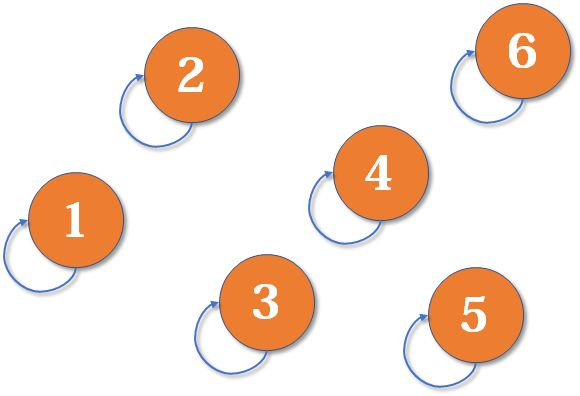

- 现在1号和3号比武，假设1号赢了（这里具体谁赢暂时不重要），那么3号就认1号作帮主（合并1号和3号所在的集合，1号为代表元素）。

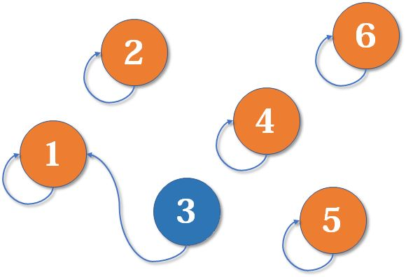

- 现在2号想和3号比武（合并3号和2号所在的集合），但3号表示，别跟我打，让我帮主来收拾你（合并代表元素）。不妨设这次又是1号赢了，那么2号也认1号做帮主。

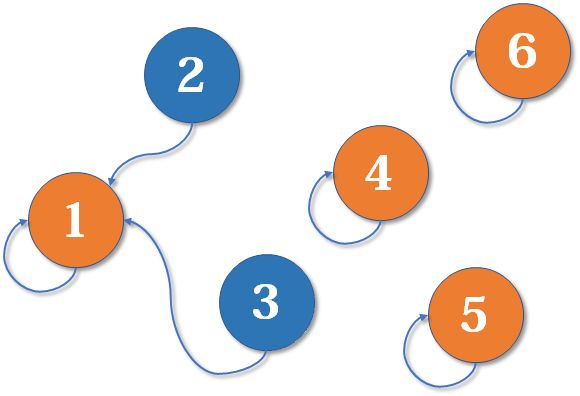

- 现在我们假设4、5、6号也进行了一番帮派合并，江湖局势变成下面这样：

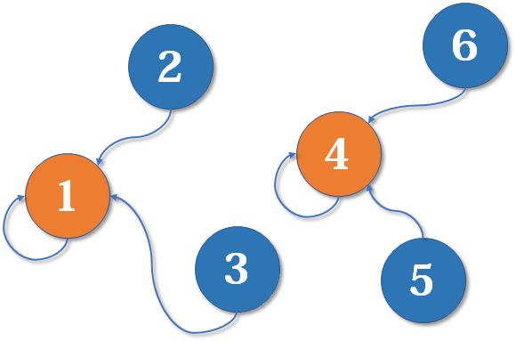

- 现在假设2号想与6号比，跟刚刚说的一样，喊帮主1号和4号出来打一架（帮主真辛苦啊）。1号胜利后，4号认1号为帮主，当然他的手下也都是跟着投降了。

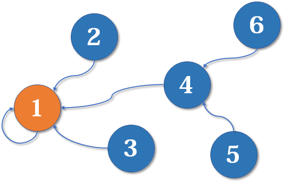

- 好了，比喻结束了。如果你有一点图论基础，相信你已经觉察到，这是一个树状的结构，要寻找集合的代表元素，只需要一层一层往上访问父节点（图中箭头所指的圆），直达树的根节点（图中橙色的圆）即可。根节点的父节点是它自己。我们可以直接把它画成一棵树：

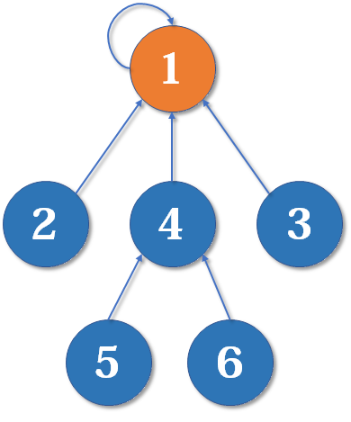

### 实现

#### 初始化
​        假如有编号为1, 2, 3, ..., n的n个元素，我们用一个数组fa[]来存储每个元素的父节点（因为每个元素有且只有一个父节点，所以这是可行的）。一开始，我们先将它们的父节点设为自己。

代码：
```java
int[] fa[MAXN];
void init(int n) {
    for (int i = 1; i <= n; ++i) {
        fa[i] = i;
    }
}
```

#### 查询
​        我们用递归的写法实现对代表元素的查询：一层一层访问父节点，直至根节点（根节点的标志就是父节点是本身）。要判断两个元素是否属于同一个集合，只需要看它们的根节点是否相同即可。

代码
```java
int find(int x) {
    if (fa[x] == x) return x;
    else return find(fa[x]);
}
```

#### 合并
​        合并操作也是很简单的，先找到两个集合的代表元素，然后将前者的父节点设为后者即可。当然也可以将后者的父节点设为前者，这里暂时不重要。本文末尾会给出一个更合理的比较方法。

代码
```java
void merge(int i, int j) { // 这里 j 作为获胜的（父节点）
    fa[find[i]] = find(j);
}
```

#### 路径压缩
- 最简单的并查集效率是比较低的。例如，来看下面这个场景：

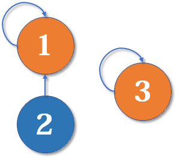

- 现在我们要merge(2,3)，于是从2找到1，fa[1]=3，于是变成了这样：


- 然后我们又找来一个元素4，并需要执行merge(2,4)：


- 从2找到1，再找到3，然后fa[3]=4，于是变成了这样：


- 大家应该有感觉了，这样可能会形成一条长长的链，随着链越来越长，我们想要从底部找到根节点会变得越来越难。

- 怎么解决呢？我们可以使用路径压缩的方法。既然我们只关心一个元素对应的根节点，那我们希望每个元素到根节点的路径尽可能短，最好只需要一步，像这样：

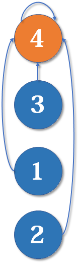

- 其实这说来也很好实现。只要我们在查询的过程中，把沿途的每个节点的父节点都设为根节点即可。下一次再查询时，我们就可以省很多事。这用递归的写法很容易实现：

#### 查询（路径压缩）
代码：
```java
int find(int x) {
    if (fa[x] == x) return x;
    else return fa[x] = find(fa[x]);
}
```

#### 模板★
```java
public class UnionFind {
    private int[] fa;
    private int n;
    
    public UnionFind(int n) {
        this.n = n;
        fa = new int[n + 1];
        init();
    }
    
    public void init() { // 初始化
        for (int i = 1; i <= n; i++) {
            fa[i] = i;
        }
    }
    
    public int find(int x) { // 查询（路径压缩）
        if (fa[x] == x) return x;
        else return fa[x] = find(fa[x]);
    }
    
    public void merge(int i, int j) { // 将 i 的父节点的父节点指向 j 的父节点
        fa[find(i)] = find(j);
    }
}
```
### 按秩合并
- 路径压缩优化后，并查集的时间复杂度已经比较低了，绝大多数不相交集合的合并查询问题都能够解决。然而，对于某些时间卡得很紧的题目，我们还可以进一步优化。

- 有些人可能有一个误解，以为路径压缩优化后，并查集始终都是一个菊花图（只有两层的树的俗称）。但其实，由于路径压缩只在查询时进行，也只压缩一条路径，所以并查集最终的结构仍然可能是比较复杂的。例如，现在我们有一棵较复杂的树需要与一个单元素的集合合并：

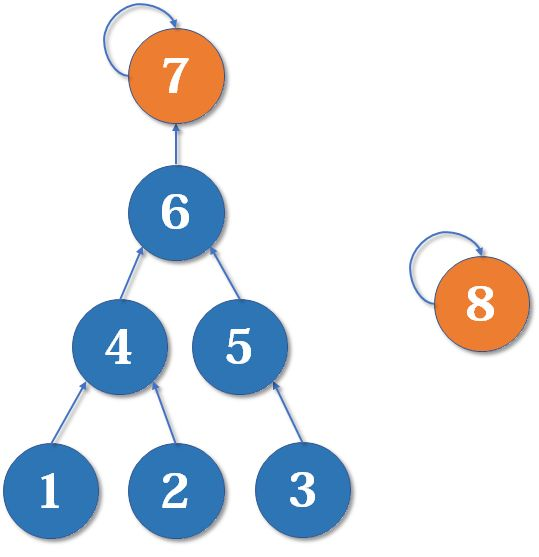

- 当然是后者。因为如果把7的父节点设为8，会使树的深度（树中最长链的长度）加深，原来的树中每个元素到根节点的距离都变长了，之后我们寻找根节点的路径也就会相应变长。虽然我们有路径压缩，但路径压缩也是会消耗时间的。而把8的父节点设为7，则不会有这个问题，因为它没有影响到不相关的节点。

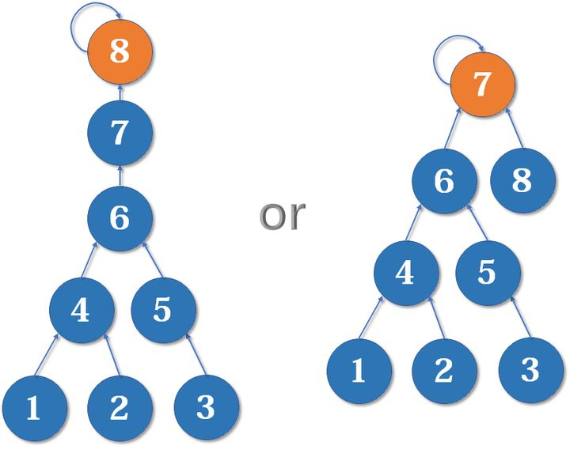

- 这启发我们：我们应该把简单的树往复杂的树上合并，而不是相反。因为这样合并后，到根节点距离变长的节点个数比较少。

- 我们用一个数组 $rank[\ ]$ 记录每个根节点对应的树的深度（如果不是根节点，其rank相当于以它作为根节点的子树的深度）。一开始，把所有元素的rank（秩）设为1。合并时比较两个根节点，把rank较小者往较大者上合并。

- 路径压缩和按秩合并如果一起使用，时间复杂度接近 $O(n)$ ，但是很可能会破坏rank的准确性。

#### 初始化（按秩合并）

代码：
```c++
inline void init(int n)
{
    for (int i = 1; i <= n; ++i)
    {
        fa[i] = i;
        rank[i] = 1;
    }
}
```

#### 合并（按秩合并）

代码：
```c++
inline void merge(int i, int j)
{
    int x = find(i), y = find(j);    //先找到两个根节点
    if (rank[x] <= rank[y])
        fa[x] = y;
    else
        fa[y] = x;
    if (rank[x] == rank[y] && x != y)
        rank[y]++;                   //如果深度相同且根节点不同，则新的根节点的深度+1
}
```

- 为什么深度相同，新的根节点深度要+1？如下图，我们有两个深度均为2的树，现在要merge(2,5)：

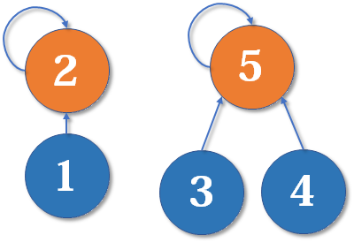

- 这里把2的父节点设为5，或者把5的父节点设为2，其实没有太大区别。我们选择前者，于是变成这样：

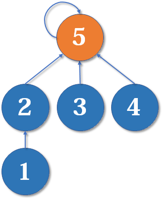

- 显然树的深度增加了1。另一种合并方式同样会让树的深度+1。

#### 模板二（按秩合并）
[P1551 亲戚](https://www.luogu.com.cn/problem/P1551)
        题意：规定：x 和 y 是亲戚，y 和 z 是亲戚，那么 x 和 z 也是亲戚。如果 x，y 是亲戚，那么 x 的亲戚都是 y 的亲戚，y 的亲戚也都是 x 的亲戚。


代码：
```c++
#include <cstdio>
#define MAXN 5005
int fa[MAXN], rank[MAXN];

inline void init(int n)
{
    for (int i = 1; i <= n; ++i)
    {
        fa[i] = i;
        rank[i] = 1;
    }
}

int find(int x)
{
    return x == fa[x] ? x : (fa[x] = find(fa[x]));
}

inline void merge(int i, int j)
{
    int x = find(i), y = find(j);
    if (rank[x] <= rank[y])
        fa[x] = y;
    else
        fa[y] = x;
    if (rank[x] == rank[y] && x != y)
        rank[y]++;
}

int main()
{
    int n, m, p, x, y;
    scanf("%d%d%d", &n, &m, &p);
    init(n);
    for (int i = 0; i < m; ++i)
    {
        scanf("%d%d", &x, &y);
        merge(x, y);
    }
    for (int i = 0; i < p; ++i)
    {
        scanf("%d%d", &x, &y);
        printf("%s\n", find(x) == find(y) ? "Yes" : "No");
    }
    return 0;
}
```


### 参考资料
[算法学习笔记(1) : 并查集](https://zhuanlan.zhihu.com/p/93647900/)